# SOFTWARE REQUIREMENTS SPECIFICATION (SRS)
## For PharmaCart - Omni-Channel Pharmacy Ordering Platform
### Document Reference: IEEE-830-PC-2026-V1.0

---

### Document Control & Metadata
* **Project Name:** PharmaCart — Online Ordering for Neighbourhood Pharmacy Chain
* **Case Study Reference:** Case Study No. 68
* **Document Standard:** IEEE Std 830-1998 (Recommended Practice for Software Requirements Specifications)
* **Author / Lead Systems Analyst:** Ritesh Jadhav
* **Target Organization:** Retail Pharmacy Chain (14 Outlets across Ahmedabad, Gujarat, India)
* **Date of Issue:** October 2026
* **Status:** Baseline Approved (Ready for Architectural Design & Sprint Planning)

---

### Revision History

| Version | Date | Author | Description of Change | Approved By |
| :--- | :--- | :--- | :--- | :--- |
| **0.1** | 2026-10-01 | Ritesh Jadhav | Initial requirements elicitation & stakeholder workshop notes | Project Steering Committee |
| **0.5** | 2026-10-03 | Ritesh Jadhav | Drafted 12 FRs, 8 Measurable NFRs, and System Context Model | Lead Pharmacist & Tech Lead |
| **1.0** | 2026-10-04 | Ritesh Jadhav | Finalized MoSCoW prioritization, RTM, and IEEE-830 baseline | Pharmacy Chain Owner & Head Pharmacist |
| **1.1** | 2026-10-04 | Ritesh Jadhav | Polished typography, resolved LaTeX math rendering, enhanced diagram layout | Quality Assurance Lead |

---

## Table of Contents
1. [Introduction](#1-introduction)
   - 1.1 Purpose
   - 1.2 Scope of the System
   - 1.3 Definitions, Acronyms, and Abbreviations
   - 1.4 References
   - 1.5 Overview of the Document
2. [Overall Description](#2-overall-description)
   - 2.1 Product Perspective & System Context Diagram
   - 2.2 Product Functions (High-Level Summary)
   - 2.3 User Classes and Stakeholder Characteristics
   - 2.4 Operating Environment
   - 2.5 Design and Implementation Constraints
   - 2.6 Assumptions and Dependencies
3. [Specific Requirements](#3-specific-requirements)
   - 3.1 Functional Requirements (FR-01 to FR-12)
   - 3.2 Non-Functional Requirements (NFR-01 to NFR-08 with Measurable Targets)
   - 3.3 MoSCoW Prioritization Matrix & Scoping Justification
4. [External Interface Requirements](#4-external-interface-requirements)
   - 4.1 User Interfaces (UI)
   - 4.2 Hardware Interfaces
   - 4.3 Software Interfaces (Legacy POS, Payment, Messaging)
   - 4.4 Communications Interfaces & Protocols
5. [Legal, Regulatory & Security Compliance](#5-legal-regulatory--security-compliance)
6. [Requirements Traceability Matrix (RTM)](#6-requirements-traceability-matrix-rtm)

---

## 1. Introduction

### 1.1 Purpose
This Software Requirements Specification (SRS) establishes the complete, authoritative specification of functional and non-functional requirements for the **PharmaCart Platform**. It serves as the baseline contract between the business sponsors (Pharmacy Chain Ownership, Retail Management, Pharmacist-in-Charge) and the engineering delivery team. 

This document defines the architectural boundaries, system behaviors, regulatory safeguards, legacy POS integration strategy, and acceptance criteria required to build and deploy Release 1.0 within a fixed 5-month timeline and ₹14 Lakh budget.

### 1.2 Scope of the System
PharmaCart is an omni-channel pharmaceutical ordering and inventory orchestration platform serving a retail network of **14 physical pharmacies located across Ahmedabad, Gujarat**. 

The system encompasses:
* A responsive customer web and mobile application for medicine browsing, prescription uploading, and order placement (Home Delivery or Store Pickup).
* A centralized **Tele-Pharmacy Prescription Verification Portal** enabling licensed pharmacists to validate Schedule H and Schedule X medication orders with digital audit trails.
* An **Inventory Aggregation and Reservation Engine** that bridges 14 isolated, on-premise store billing systems via lightweight synchronization agents and an intelligent **Safety Stock Buffer algorithm**.
* A store dispatch and pickup fulfillment interface for in-store staff.

**Out of Scope for Release 1.0:**
* Automated recurring chronic medication auto-refill subscriptions (deferred to Release 2.0 under Change Control).
* Universal cross-store unmoderated discount coupons (deferred to Release 2.0 to eliminate fraud exposure).
* Autonomous drone or third-party courier inter-state logistics.

### 1.3 Definitions, Acronyms, and Abbreviations

| Term / Acronym | Definition |
| :--- | :--- |
| **AES-256** | Advanced Encryption Standard with a 256-bit key length for secure cryptographic data storage. |
| **BVA** | Boundary Value Analysis — a black-box test design technique. |
| **CDSCO** | Central Drugs Standard Control Organisation (India). |
| **DCI** | Drugs Controller of India. |
| **DRE** | Defect Removal Efficiency — percentage of total defects filtered out before product release. |
| **DPDP Act 2023** | Digital Personal Data Protection Act, 2023 (Government of India). |
| **FR / NFR** | Functional Requirement / Non-Functional Requirement. |
| **MoSCoW** | Must have, Should have, Could have, Won't have prioritization technique. |
| **OTC** | Over-The-Counter medication (requires no physician prescription, e.g., paracetamol, antacids). |
| **POS** | Point of Sale / Local Store Billing Software installed on physical counter terminals. |
| **RTM** | Requirements Traceability Matrix. |
| **Rx** | Medical Prescription issued by a registered medical practitioner (RMP). |
| **Safety Stock Buffer**| Algorithmic quantity deducted from physical inventory before publishing online stock availability. |
| **Schedule H / H1 / X** | Drug schedules governed by the Indian Drugs and Cosmetics Rules, 1945, requiring verified physical prescriptions. |
| **SLA** | Service Level Agreement. |

### 1.4 References
1. IEEE Std 830-1998: *IEEE Recommended Practice for Software Requirements Specifications*.
2. The Drugs and Cosmetics Act, 1940 and The Drugs and Cosmetics Rules, 1945 (Government of India).
3. Pharmacy Practice Regulations, 2015, Pharmacy Council of India.
4. Digital Personal Data Protection Act, 2023 (Ministry of Electronics and Information Technology, India).
5. ISO/IEC/IEEE 29148:2018: *Systems and Software Engineering — Life Cycle Processes — Requirements Engineering*.

### 1.5 Overview of the Document
Section 2 contextualizes the system architecture and operating constraints. Section 3 articulates the core requirements (12 FRs and 8 measurable NFRs). Section 4 outlines external interfaces. Section 5 formalizes legal constraints, and Section 6 details the end-to-end Traceability Matrix.

---

## 2. Overall Description

### 2.1 Product Perspective & System Context Diagram
PharmaCart operates as a centralized cloud coordination layer that overlays the existing distributed retail ecosystem. The 14 pharmacy outlets currently maintain disjoint local billing software databases (PostgreSQL, MS SQL Express, or flat-file POS systems). PharmaCart does not replace these billing systems immediately; instead, it deploys a read-only **Local Store Sync Agent** at each outlet, continuously synchronizing delta stock levels to the central PharmaCart Cloud.

#### System Context Diagram (Level-0 DFD / Boundary Model)

```mermaid
flowchart TD
    %% Styling definitions
    classDef actor fill:#E1F5FE,stroke:#0288D1,stroke-width:2px,color:#01579B,font-weight:bold;
    classDef system fill:#E8F5E9,stroke:#388E3C,stroke-width:2px,color:#1B5E20,font-weight:bold;
    classDef external fill:#FFF3E0,stroke:#F57C00,stroke-width:2px,color:#E65100,font-weight:bold;
    classDef storage fill:#F3E5F5,stroke:#7B1FA2,stroke-width:2px,color:#4A148C,font-weight:bold;

    %% Primary Actors
    CUSTOMER["Customer<br>(Web / Mobile App)"]:::actor
    PHARMACIST["Licensed Pharmacist<br>(Tele-Pharmacy Desk)"]:::actor
    STAFF["Store Staff<br>(14 Retail Outlets)"]:::actor

    %% Central Platform
    subgraph PHARMACART_CLOUD [" PharmaCart Central Cloud Platform "]
        direction TB
        CORE["PharmaCart Core Engine<br>(API, Routing & Buffer Logic)"]:::system
        DB[("Central Database<br>(PostgreSQL 16)")]:::storage
        VAULT[("Prescription Vault<br>(AES-256 Storage)")]:::storage
        CORE <--> DB
        CORE <--> VAULT
    end

    %% External Systems
    POS_SYSTEMS["14 Local POS Terminals<br>(Store Billing Systems)"]:::external
    PAY_GATEWAY["Payment Gateway<br>(Razorpay / UPI)"]:::external
    NOTIF_GATEWAY["Notification Service<br>(SMS / WhatsApp)"]:::external

    %% Clean Data Flow Connections
    CUSTOMER -->|"1. Orders & Prescriptions"| CORE
    CORE -->|"2. Status & Invoices"| CUSTOMER

    CORE -->|"3. Verification Queue"| PHARMACIST
    PHARMACIST -->|"4. Digital Sign-off (Reg ID)"| CORE

    POS_SYSTEMS -->|"5. Delta Inventory Sync"| CORE
    CORE -->|"6. 30-Min Soft Stock Lock"| POS_SYSTEMS

    CORE -->|"7. Packing Slips & OTP Check"| STAFF
    STAFF -->|"8. Dispatch Confirmation"| CORE

    CORE -->|"9. Payment Processing"| PAY_GATEWAY
    CORE -->|"10. Trigger Notifications"| NOTIF_GATEWAY
    NOTIF_GATEWAY -->|"11. SMS Delivery"| CUSTOMER
```



#### System Context Interaction Matrix

| Flow # | Source Entity | Target Entity | Data / Message Transferred | Protocol / Mechanism |
| :---: | :--- | :--- | :--- | :--- |
| **1** | Customer | PharmaCart Core | Cart items, delivery type, prescription image/PDF | HTTPS POST / Multipart Form |
| **2** | PharmaCart Core | Customer | Live order status, digital tax invoice, tracking link | HTTPS / WebSocket |
| **3** | PharmaCart Core | Pharmacist Desk | Pending verification queue, doctor name, Rx file | HTTPS Secure Portal |
| **4** | Pharmacist Desk | PharmaCart Core | Approval / Rejection reason + Pharmacist Reg. ID | Signed JSON Payload (mTLS) |
| **5** | 14 Store POS | PharmaCart Core | Periodic delta stock levels, batch numbers, expiries | WSS / Outbound HTTPS (Every 30s) |
| **6** | PharmaCart Core | 14 Store POS | 30-minute soft reservation lock for pending orders | Encrypted POS RPC / Webhook |
| **7** | PharmaCart Core | Store Staff | Barcode picking slip, thermal bag label | Store Terminal Web Interface |
| **8** | Store Staff | PharmaCart Core | Order packed status, customer pickup OTP validation | Store Terminal Form Submit |
| **9** | PharmaCart Core | Payment Gateway | Payment session initialization & signature verification | Razorpay REST API + Webhooks |
| **10** | PharmaCart Core | Notification Gateway | Transactional SMS / WhatsApp dispatch alerts, OTPs | Karix / Twilio REST API |
| **11** | Notification Gateway | Customer | SMS with OTP for store pickup or delivery tracking | Cellular GSM / WhatsApp Network |

---

### 2.2 Product Functions (High-Level Summary)
* **Patient Digital Experience:** Search medicines by generic salt name or brand name, upload prescription photos/PDFs, select delivery method (Home Delivery or Store Pickup from one of 14 Ahmedabad locations), and make secure digital payments.
* **Tele-Pharmacy Verification Desk:** Real-time dual-pane verification terminal allowing any available licensed pharmacist across the 14 stores to inspect prescriptions, validate doctor details, edit order quantities if necessary, and digitally stamp approvals.
* **Smart Inventory Reservation & Multi-Store Routing:** Evaluates inventory across all 14 stores, enforces a safety buffer (`Effective_Stock = Physical_Stock - Safety_Buffer`), holds items temporarily, and auto-routes orders to the geographically optimal sister branch if a stock shortage is detected.
* **Store Counter Fulfillment:** Generates barcode-enabled picking slips for store assistants and validates customer collection via one-time passwords (OTP).

### 2.3 User Classes and Stakeholder Characteristics

| User Class | Technical Sophistication | Operational Role & Access Rights |
| :--- | :--- | :--- |
| **Retail Customer** | Moderate to Low | Browses catalog, uploads prescriptions, inputs delivery addresses, places and tracks orders, verifies pickup via OTP. |
| **Licensed Pharmacist** | Moderate | Certified professional (B.Pharm/D.Pharm). Validates prescriptions against schedule drug catalogs; authorizes or rejects medication dispatches. |
| **Store Staff / Counter Clerk**| Moderate to Low | Operates POS and store counter. Accesses picking slips, physically packs items, confirms hand-over to customers or local delivery runners. |
| **Chain Operations Admin** | High | System administrators, inventory managers, and customer support supervisors managing store routing rules, auditing logs, and handling exceptions. |
| **Marketing Department** | High | Analyzes campaign metrics, drafts coupon rules, and monitors customer retention programs (post-MVP). |

### 2.4 Operating Environment
* **Client Frontend:** Modern web browsers (Chromium >= 110, Safari >= 16, Firefox >= 115) and responsive mobile web viewports (360px to 1920px).
* **Application Server:** Containerized Node.js/Python cloud microservices hosted on AWS India (ap-south-1 Mumbai region) or DigitalOcean Bangalore to minimize network latency within Gujarat.
* **Database & Storage:** PostgreSQL 16 (Relational transactional data) with AES-256 encrypted Object Storage (AWS S3 / MinIO) for prescription image storage.
* **Store Client Terminals:** Windows 10/11 POS terminals located at the 14 Ahmedabad pharmacy stores running the lightweight PharmaCart Local Sync Daemon.

### 2.5 Design and Implementation Constraints
1. **Financial Ceiling (₹14.0 Lakh Hard Cap):** Team monthly burn is strictly ₹2.4 Lakh. With ₹1.6 Lakh reserved for hosting, SSL, SMS gateways, and payment setup, the development runway cannot exceed **5.16 months**.
2. **Delivery Timeline (5 Months):** Hard deadline established by retail management. All Release 1.0 scope must achieve production stability by Month 3, leaving Months 4 and 5 for staging, pilot rollouts across the 14 stores, and stabilization.
3. **Statutory Legal Compliance:** Strictly governed by India's *Drugs and Cosmetics Act (1940)* and *Pharmacy Practice Regulations (2015)*. Dispensing prescription drugs without a pharmacist's verified digital signature is a non-bailable regulatory offense.
4. **Decentralized Legacy POS Architecture:** The 14 store billing installations are heterogeneous, offline-first systems without public static IPs or existing cloud APIs. No direct database writes from the cloud into store billing databases are permitted.

### 2.6 Assumptions and Dependencies
* **Assumption 1:** Each of the 14 stores possesses a reliable broadband internet connection (speed >= 10 Mbps) on their counter billing terminal with an average uptime >= 98%.
* **Assumption 2:** At least one certified pharmacist is on duty across the pharmacy chain during operational store hours (08:00 AM to 11:00 PM IST) to maintain verification SLAs.
* **Dependency 1:** Integrated third-party SMS/WhatsApp gateway (e.g., Twilio/Karix) approval for transactional DLT-registered message templates under TRAI regulations.
* **Dependency 2:** Payment gateway onboarding (e.g., Razorpay/PayU) for PCI-DSS compliant online checkout.

---

## 3. Specific Requirements

### 3.1 Functional Requirements (FR-01 to FR-12)

#### [FR-01] Prescription Upload & Pre-Processing
* **Description:** The system shall allow customers to upload digital images (JPEG, PNG) or PDF copies of their medical prescription during checkout or as an independent step.
* **Inputs:** File attachment (Max file size: 10 MB), patient full name, age, gender.
* **Processing:** 
  1. Validate file mime-type and scan for malicious payloads.
  2. Compress image using lossy WebP compression without degrading text legibility.
  3. Encrypt file using AES-256 and store in the private prescription vault.
  4. Generate a unique `Prescription_ID` and link to `Customer_ID`.
* **Outputs:** Prescription preview thumbnail, successful upload confirmation, and unique tracking token.
* **Business Rule:** A prescription is mandatory if the customer cart contains at least one item categorized as Schedule H, H1, or X.

#### [FR-02] Tele-Pharmacy Verification Desk
* **Description:** The system shall provide a dedicated, secure dashboard for licensed pharmacists to inspect, validate, and digitally sign off on prescriptions.
* **Inputs:** Pharmacist authentication credentials, digital signature/PIN, review action (`APPROVE`, `REJECT`, `MODIFIED`).
* **Processing:** 
  1. Orders containing prescription items enter the central `PENDING_VERIFICATION` FIFO queue.
  2. Dual-pane UI displays prescription document with pan/zoom alongside mapped cart items.
  3. Pharmacist cross-references: Doctor's name & Medical Council Registration Number, Patient Name, Date of Prescription, Medicine Name, Strength, and Prescribed Quantity.
  4. In case of rejection, the pharmacist must select a predefined rejection reason (e.g., Expired Prescription, Illegible Handwriting, Missing Doctor Seal/Signature, Drug Overdose/Quantity Limit Exceeded).
* **Outputs:** Timestamped audit record appending Pharmacist Name, Pharmacy Council Registration ID, and Approval Status to the order.

#### [FR-03] Schedule Drug Catalog & Regulatory Categorization
* **Description:** The system shall categorize every SKU in the pharmaceutical master catalog with regulatory dispensing attributes.
* **Inputs:** Drug Master Data (Brand Name, Generic Salt, Manufacturer, Form, Strength, Schedule Category).
* **Processing:** Apply validation flags: `Is_Rx_Required` (Boolean), `Schedule_Type` (OTC, H, H1, X), `Max_Allowed_Quantity_Per_Order`.
* **Outputs:** Catalog browse views indicating clear visual badges ("Rx Required" or "OTC").
* **Business Rule:** Schedule X drugs (narcotics/psychotropics) are barred from online home delivery and must be restricted to physical in-store verification and pickup only.

#### [FR-04] Distributed Store Inventory Synchronization Agent
* **Description:** The system shall ingest delta inventory updates from the 14 local pharmacy billing software clients.
* **Inputs:** Encrypted JSON payload from local POS sync agent: `{Store_ID, Timestamp, SKU_ID, Physical_Stock_Count, Batch_Number, Expiry_Date}`.
* **Processing:** 
  1. Authenticate store daemon via mutual TLS and store API key.
  2. Update central cache (`Store_Inventory_Map`).
  3. Exclude batches with expiry date < 90 days from available online stock.
* **Outputs:** Updated aggregated store stock ledger.

#### [FR-05] Dynamic Safety Stock Buffer & Stock Reservation
* **Description:** The system shall enforce an automated safety stock deduction algorithm to prevent selling items concurrently purchased by physical walk-in customers.
* **Inputs:** `Physical_Stock_Count`, configured store safety threshold (Default = 2 units).
* **Processing:**
  The system calculates available online stock using the formula:
  ```text
  Effective_Available_Stock = MAX(0, Physical_Stock_Count - Safety_Stock_Buffer)
  ```
  - When an online customer initiates checkout, the system places a temporary **Soft Hold** on the inventory for exactly 30 minutes.
  - If payment and verification succeed within 30 minutes, the hold converts to a hard allocation. Otherwise, the units are released back to stock.
* **Outputs:** Real-time stock availability badge (`In Stock`, `Low Stock`, `Out of Stock`) presented to customer.
* **Business Rule:** If physical stock is <= 2 units, the online system must report "Out of Stock" for that specific store to safeguard counter customers.

#### [FR-06] Multi-Store Order Routing & Branch Allocation
* **Description:** The system shall assign an approved order to the geographically optimal store among the 14 Ahmedabad outlets that fulfills 100% of the basket.
* **Inputs:** Customer delivery GPS coordinates / pincode, store inventory states, order fulfillment type (`HOME_DELIVERY` or `STORE_PICKUP`).
* **Processing:**
  1. For `STORE_PICKUP`: Validate stock at the customer's explicitly chosen store.
  2. For `HOME_DELIVERY`: Calculate geodesic distance to all 14 stores; filter stores possessing full inventory; select the store with the lowest transit distance.
  3. If no single store has complete stock, split-order logic or sister-store transfer suggestions are triggered.
* **Outputs:** Store fulfillment ticket assigned to target `Store_ID`.

#### [FR-07] Store Counter Picking & Packing Interface
* **Description:** The system shall render a picking and packing interface on the assigned store's counter terminal.
* **Inputs:** Store clerk scan/confirmation of physical item barcodes, batch numbers, and expiry dates.
* **Processing:**
  1. Display picking list sorted by store rack/shelf location.
  2. Verify scanned batch matches physical item.
  3. Trigger automated printing of thermal packing slip and patient instruction label.
* **Outputs:** Order state transition from `ALLOCATED` to `PACKED_READY`.

#### [FR-08] In-Store Pickup Verification via Secure OTP
* **Description:** The system shall authenticate store pickup hand-offs using an encrypted one-time password (OTP).
* **Inputs:** 6-digit numeric OTP submitted by customer at counter.
* **Processing:** Store clerk enters OTP into terminal; cloud verifies OTP against active `Order_ID` cryptographic hash.
* **Outputs:** Immediate order completion, electronic tax invoice generation, and SMS confirmation to customer.
* **Business Rule:** Hand-over without verified OTP is strictly blocked on the terminal.

#### [FR-09] Home Delivery Dispatch & Rider Manifest
* **Description:** The system shall generate dispatch manifests for in-house pharmacy delivery runners.
* **Inputs:** Rider assignment, vehicle number, cash collection flag (if COD permitted).
* **Processing:** Bundle orders by Ahmedabad delivery zones (e.g., Navrangpura, Satellite, Bodakdev, Maninagar); issue tamper-evident bag seal numbers.
* **Outputs:** Digital manifest on rider mobile portal and SMS dispatch alert to customer with live tracking link.

#### [FR-10] Multi-Tier Payment Gateway Integration
* **Description:** The system shall facilitate digital payments through integrated payment aggregators.
* **Inputs:** Payment method selection (UPI, Credit/Debit Card, Net Banking).
* **Processing:** 
  1. Generate cryptographic payment session token via Razorpay/UPI gateway.
  2. Handle asynchronous webhooks for payment success, failure, and refunds.
  3. Maintain idempotency keys to prevent duplicate deductions.
* **Outputs:** Digital tax invoice (compliant with GST regulations) and updated order financial ledger.

#### [FR-11] Patient Medication History & Digital Prescription Locker
* **Description:** The system shall provide registered customers with a secure historical repository of past orders, invoices, and verified prescriptions.
* **Inputs:** Customer authentication token.
* **Processing:** Query encrypted records associated with `Customer_ID`; render downloadable GST invoices and archived prescriptions.
* **Outputs:** Responsive UI view of prescription records with "Reorder OTC" shortcuts.

#### [FR-12] Single-Use Promotional Coupon Engine (Constrained Release-1 Scope)
* **Description:** The system shall evaluate and apply constrained promotional discounts exclusively to non-prescription (OTC) items.
* **Inputs:** Alphanumeric coupon code entered at checkout.
* **Processing:**
  1. Verify coupon code validity, expiry date, and active status.
  2. Check customer usage history: Enforce limit of 1 redemption per verified mobile number.
  3. Enforce cart minimum threshold (Cart subtotal >= ₹500).
  4. Compute discount strictly against OTC items (Prescription items excluded from discount base).
  5. Cap maximum discount at ₹100.
* **Outputs:** Recalculated order subtotal, itemized discount breakdown, or clear rejection error message.

---

### 3.2 Non-Functional Requirements (NFR-01 to NFR-08)
Every NFR below includes an explicit, quantifiable metric, a testing method, and an operational threshold.

| NFR Identifier | Quality Attribute / Requirement | Operational Target Metric | Measurement Frequency |
| :---: | :--- | :--- | :--- |
| **NFR-01** | Inventory Sync Latency | <= 30 Seconds from store sale | Continuous (automated logs) |
| **NFR-02** | Pharmacist Verification SLA | <= 15 Minutes for 90% orders | Operational hours (08:00 - 23:00) |
| **NFR-03** | Stock Availability Accuracy | >= 98.0% order fulfillment | Daily batch audit |
| **NFR-04** | Platform Availability | >= 99.9% uptime (<= 43.8 min/mo) | Continuous synthetic monitoring |
| **NFR-05** | UI Performance & Latency | p95 <= 300 ms API / LCP <= 2.0s | Real User Monitoring (RUM) |
| **NFR-06** | Cryptographic Security | AES-256 at rest, TLS 1.3 in transit | CI/CD automated scan |
| **NFR-07** | Peak Concurrency & Throughput | >= 500 users, >= 50 orders/min | Pre-release load testing |
| **NFR-08** | Regulatory Audit Retention | 100% Immutable logs for 3 years | Daily cryptographic hashing |

#### [NFR-01] Inventory Synchronization Latency
* **Target Metric:** Maximum latency <= 30 seconds from physical sale completion at store counter to cloud stock decrement.
* **Measurement Method:** Automated timestamp differential between local POS transaction log commit and central cloud database cache update.
* **Rationale:** Reduces race conditions between offline counter walk-ins and concurrent online shoppers.

#### [NFR-02] Pharmacist Verification SLA
* **Target Metric:** >= 90% of submitted prescriptions reviewed and resolved (approved/rejected) within <= 15 minutes during standard operating hours (08:00 to 23:00 IST).
* **Measurement Method:** System event log delta between `PRESCRIPTION_UPLOAD_COMPLETED` and `PHARMACIST_DECISION_RECORDED`.
* **Rationale:** Prevents customer abandonment and curbs order dispatch bottlenecks.

#### [NFR-03] Online Stock Availability Accuracy
* **Target Metric:** >= 98.0% accuracy between online catalog stock status and physical shelf audit. Less than 2.0% of accepted orders subject to cancellation due to physical stockout.
* **Measurement Method:** 
  ```text
  Stock Accuracy Rate (%) = [ 1 - (Total Orders Cancelled Due to Stockout / Total Online Orders Placed) ] * 100
  ```
* **Rationale:** Directly mitigates the highest project risk (Risk #1: P=0.6, I=7, Exposure=4.2).

#### [NFR-04] System Availability & Reliability
* **Target Metric:** >= 99.9% operational uptime during peak commercial hours (07:00 to 23:59 IST daily), allowing no more than 43.8 minutes of unscheduled downtime per month.
* **Measurement Method:** CloudWatch / synthetic uptime monitoring pinging `/healthz` endpoints at 60-second intervals from multiple geographical zones.
* **Rationale:** Unavailability of pharmacy services directly compromises critical patient healthcare access.

#### [NFR-05] Frontend Performance & Response Latency
* **Target Metric:** 
  * 95th percentile (p95) API response time <= 300 ms under baseline load.
  * Largest Contentful Paint (LCP) <= 2.0 seconds over standard 4G mobile networks.
* **Measurement Method:** Google Lighthouse performance audits and New Relic APM transaction traces.
* **Rationale:** Fast mobile rendering ensures friction-free shopping for elderly or distressed patients.

#### [NFR-06] Data Security & Privacy Compliance
* **Target Metric:** 100% of stored medical prescriptions encrypted at rest using AES-256; 100% of network data in transit encrypted using TLS 1.3. Zero plaintext storage of patient identifiers or health data.
* **Measurement Method:** Automated OWASP ZAP vulnerability scans and static code analysis (SonarQube) during CI/CD.
* **Rationale:** Ensures compliance with India's Digital Personal Data Protection (DPDP) Act, 2023.

#### [NFR-07] Peak Concurrent Concurrency & Scalability
* **Target Metric:** System must support >= 500 concurrent active browsing sessions and process >= 50 order placements per minute without server degradation (0% HTTP 5xx errors).
* **Measurement Method:** Distributed load testing using k6 / Apache JMeter simulating 500 virtual users across Ahmedabad pincodes.
* **Rationale:** Accommodates seasonal health surges (e.g., monsoon viral outbreaks or epidemic seasons).

#### [NFR-08] Regulatory Audit Trail Immutability & Retention
* **Target Metric:** 100% of prescription approvals, modifications, rejections, and pharmacist identities retained in append-only immutable storage for a mandatory minimum of **3 years (1,095 days)**.
* **Measurement Method:** Cryptographic SHA-256 hash chaining of audit table records, verified via scheduled database integrity checks.
* **Rationale:** Mandatory statutory compliance under Section 65 of the Indian Drugs and Cosmetics Rules.

---

### 3.3 MoSCoW Prioritization Matrix & Scoping Justification

To adhere strictly to the **₹14.0 Lakh budget** and **5-month delivery constraint**, the total product backlog of 118 story points is formally categorized. Only **Must-Have** items (72 points) constitute the contractual Release 1.0 scope.

| Priority Tier | Release Target | Story Points | Key Inclusions & Scope Summary |
| :--- | :--- | :---: | :--- |
| **Must Have** | Release 1.0 (Core MVP) | **72 pts** | Medicine catalog, prescription upload, tele-pharmacist review queue, 14-store POS sync with safety buffer, store pickup, in-house delivery, OTP verification. |
| **Should Have** | Release 1.1 (Hardened) | **22 pts** | Restricted OTC single-use coupons, sister-store automatic route rebalancing, payment gateway webhooks. |
| **Could Have** | Release 2.0 (Growth) | **16 pts** | WhatsApp conversational prescription upload, automated medication reminder notifications. |
| **Won't Have** | Deferred to Phase 3 | **8 pts** | Unrestricted marketing discount coupons, automated chronic medication recurring refill subscriptions. |

| Requirement ID | Feature Description | Story Points | MoSCoW Priority | Target Release | Scoping Rationale |
| :--- | :--- | :---: | :---: | :---: | :--- |
| **FR-01** | Prescription Upload & Pre-Processing | 8 | **Must Have** | Release 1.0 | Regulatory prerequisite for dispensing scheduled drugs. |
| **FR-02** | Tele-Pharmacy Verification Desk | 13 | **Must Have** | Release 1.0 | Absolute legal mandate from Pharmacist-in-Charge. |
| **FR-03** | Schedule Drug Catalog Engine | 5 | **Must Have** | Release 1.0 | Categorizes OTC vs Rx to prevent unlawful sales. |
| **FR-04** | Distributed Store POS Sync Agent | 13 | **Must Have** | Release 1.0 | Core technical challenge; connects 14 offline stores. |
| **FR-05** | Safety Stock Buffer & Reservation | 8 | **Must Have** | Release 1.0 | Mitigates Risk #1 (Stock mismatch causing cancellations). |
| **FR-06** | Store Allocation & Order Routing | 8 | **Must Have** | Release 1.0 | Enables routing to closest store in Ahmedabad. |
| **FR-07** | Store Picking & Packing Terminal | 5 | **Must Have** | Release 1.0 | Required for store clerks to fulfill orders physically. |
| **FR-08** | In-Store Pickup Verification (OTP) | 5 | **Must Have** | Release 1.0 | Fulfills customer demand for counter pickup safely. |
| **FR-09** | Home Delivery Dispatch Manifest | 7 | **Must Have** | Release 1.0 | Coordinates in-house pharmacy runners. |
| **FR-10** | Payment Gateway (Razorpay/UPI) | 8 | **Should Have** | Release 1.0 | Direct monetization; fallback to Cash on Delivery. |
| **FR-11** | Patient Prescription Vault History | 6 | **Should Have** | Release 1.1 | Enhances repeat order retention for chronic users. |
| **FR-12** | Restricted Single-Use OTC Coupons | 8 | **Could Have** | Release 1.1 | Marketing desire; capped to prevent financial fraud. |
| **CR-SUB** | Chronic Medicine Auto-Refill Sub | 14 | **Won't Have** | Release 2.0 | High technical complexity; requires recurring card tokenization and perpetual Rx validation. |

---

## 4. External Interface Requirements

### 4.1 User Interfaces (UI)
* **Customer Interface:** Responsive Single Page Application (SPA) optimized for touchscreens. High-contrast typography (compliant with WCAG 2.1 AA) catering to elderly demographics. Prominent floating action button: `[+ Upload Doctor's Prescription]`.
* **Pharmacist Verification UI:** Split-screen layout. Left viewport: High-resolution zoomable image viewer with rotation, contrast-enhancement, and brightness controls. Right viewport: Structured medicine checklist with one-click quantity adjustment and instant validation against standard pharmaceutical databases.
* **Store Counter Fulfillment UI:** Clean, keyboard-navigable interface designed for low-spec POS monitors. High-visibility state indicators (e.g., Amber for "Pending Packing", Green for "Ready for Pickup").

### 4.2 Hardware Interfaces
* **Thermal Receipt Printers:** USB / Ethernet ESC/POS thermal printers (80mm width) connected to store billing PCs for packing slips and pickup receipts.
* **Barcode Scanners:** Standard 1D/2D handheld USB barcode scanners for rapid SKU validation during order packing.
* **Mobile Devices:** Android >= 11 and iOS >= 15 smartphones for delivery runners and customers.

### 4.3 Software Interfaces
* **14 Store POS Billing Databases:** Local Store Sync Agent communicates via read-only SQL queries or exported inventory CSV deltas from legacy software (e.g., Marg ERP, MediVision, or custom local billing tools).
* **Payment Gateway:** Razorpay / Cashfree REST APIs supporting UPI DeepLinking, Dynamic QR codes, and Webhook transaction notifications.
* **SMS & Messaging Gateway:** Karix / Twilio transactional API integration using DLT-registered templates for order updates, verification status, and OTPs.

### 4.4 Communications Interfaces & Protocols
* **Client to Cloud:** HTTPS over TLS 1.3 on port 443 with HSTS (HTTP Strict Transport Security) enabled.
* **POS Agent to Cloud:** Outbound-only WebSocket (WSS) or HTTPS polling at 30-second intervals to eliminate firewall configuration hurdles at retail stores.
* **Data Serialization:** Lightweight JSON format with gzip/brotli compression.

---

## 5. Legal, Regulatory & Security Compliance

1. **Drugs and Cosmetics Act, 1940 & Rules 1945:**
   - Under no circumstances shall Schedule H, H1, or X medications be processed, packed, or dispatched without a valid prescription authored by an RMP (Registered Medical Practitioner).
   - The dispensing pharmacist's name, degree, and State Pharmacy Council Registration Number must be permanently recorded on every tax invoice.
2. **Prescription Validity Rules:**
   - Acute illness prescriptions are deemed expired if dated > 30 days prior to upload.
   - Chronic illness prescriptions are limited to a maximum reorder validity of 6 months.
3. **Digital Personal Data Protection (DPDP) Act, 2023:**
   - Patient health information (PHI) and uploaded prescription imagery are classified as sensitive personal data.
   - Prescriptions must be accessible strictly on a role-based need-to-know basis (Customer and Duty Pharmacist only). Store assistants and delivery runners see only packed bag identifiers, never medical diagnoses.

---

## 6. Requirements Traceability Matrix (RTM)

The following matrix establishes forward and backward traceability, connecting each Functional Requirement to its Architectural Component, its Test Case Suite, and its corresponding MoSCoW Release Scope.

| Req ID | Requirement Summary | Architectural Module | Primary Test Case ID | Test Type | Release Phase |
| :---: | :--- | :--- | :---: | :---: | :---: |
| **FR-01** | Prescription Upload & Pre-Processing | `PrescriptionService` | `TC-RX-01`, `TC-RX-02` | Functional / Security | Release 1.0 (Must) |
| **FR-02** | Tele-Pharmacy Verification Desk | `PharmacistPortal` | `TC-VR-01`, `TC-VR-02` | Workflow / Integration | Release 1.0 (Must) |
| **FR-03** | Schedule Drug Catalog Engine | `CatalogService` | `TC-CAT-01` | Business Rules | Release 1.0 (Must) |
| **FR-04** | Distributed Store POS Sync Agent | `InventorySyncBroker`| `TC-INV-01`, `TC-INV-02`| System / Stress | Release 1.0 (Must) |
| **FR-05** | Safety Stock Buffer & Reservation | `ReservationManager` | `TC-BUF-01`, `TC-BUF-02`| Boundary Value / Concurrency | Release 1.0 (Must) |
| **FR-06** | Store Allocation & Order Routing | `RoutingEngine` | `TC-RT-01` | Decision Table | Release 1.0 (Must) |
| **FR-07** | Store Picking & Packing Terminal | `FulfillmentPortal` | `TC-PK-01` | Functional | Release 1.0 (Must) |
| **FR-08** | In-Store Pickup Verification (OTP) | `AuthSecurityService` | `TC-OTP-01`, `TC-OTP-02`| Security / Edge Case | Release 1.0 (Must) |
| **FR-09** | Home Delivery Dispatch Manifest | `LogisticsService` | `TC-LOG-01` | Integration | Release 1.0 (Must) |
| **FR-10** | Payment Gateway Integration | `PaymentService` | `TC-PAY-01`, `TC-PAY-02`| Financial / Webhook | Release 1.0 (Should)|
| **FR-11** | Patient Prescription Vault History | `PatientVaultService` | `TC-VLT-01` | Data Privacy | Release 1.1 (Should)|
| **FR-12** | Restricted Single-Use OTC Coupons | `PromotionService` | `TC-CPN-01`, `TC-CPN-02`| Boundary Value / Fraud | Release 1.1 (Could) |

---

### Formal Sign-Off & Acceptance

*By signing below, the undersigned stakeholders confirm that this SRS document accurately captures the operational, functional, and regulatory needs of the PharmaCart platform and establishes the approved baseline for design and sprint estimation.*

**Prepared By:**  
`Ritesh Jadhav`  
Lead Systems Analyst  
PharmaCart Engineering Team  
Date: October 4, 2026  

**Reviewed & Endorsed By:**  
`Head Pharmacist-in-Charge`  
Chief Pharmacist, Ahmedabad Central Outlets  
Date: October 4, 2026  

**Approved By:**  
`Managing Director & Owner`  
PharmaCart Retail Pharmacy Chain  
Date: October 4, 2026  
