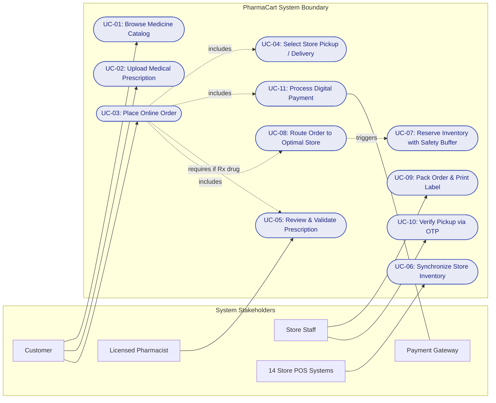
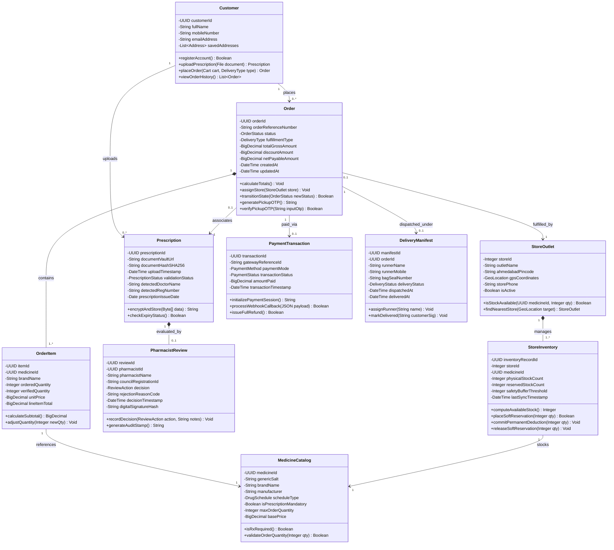
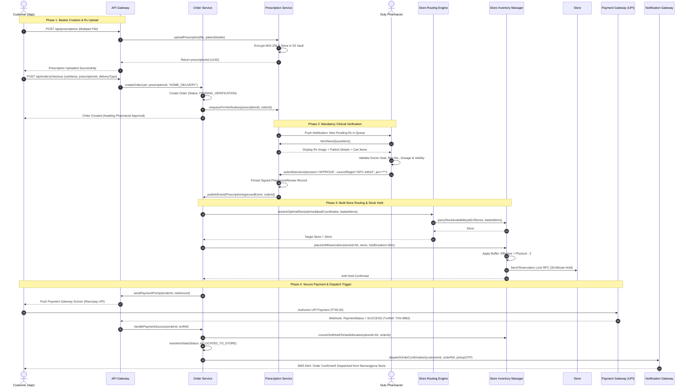
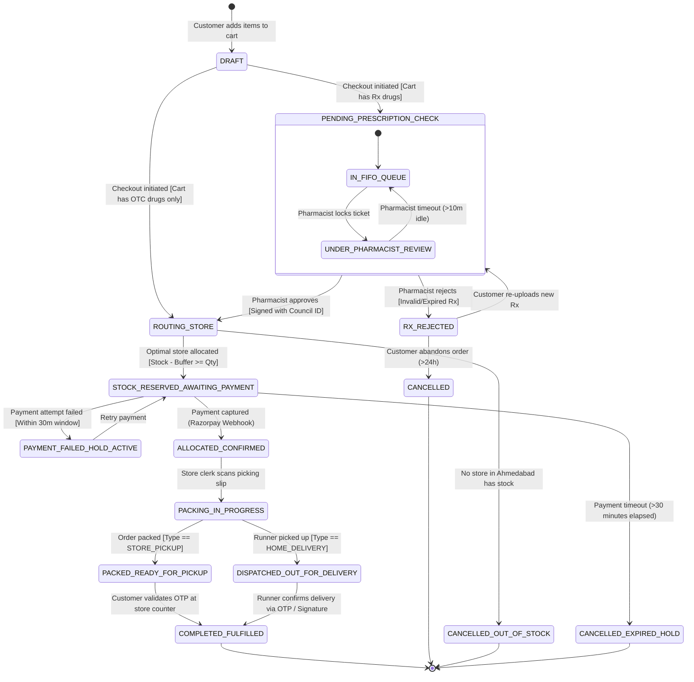
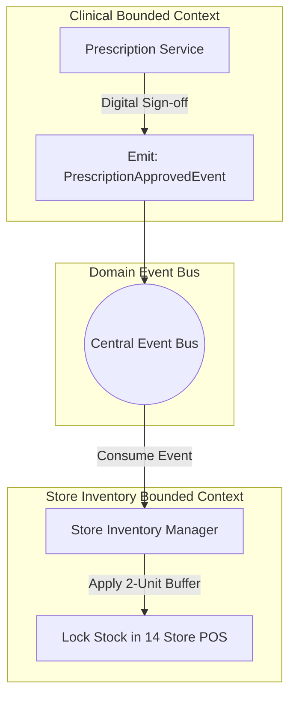
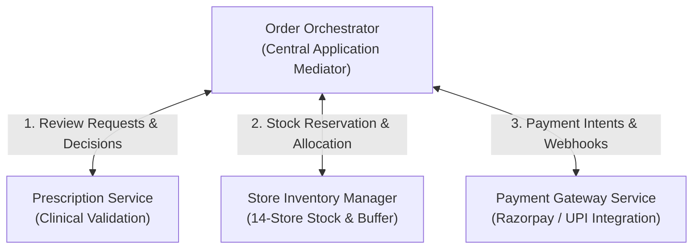

# SOFTWARE DESIGN & UML ARCHITECTURE SPECIFICATION
## For PharmaCart - Omni-Channel Pharmacy Ordering Platform
### Document Reference: UML-PC-2026-V1.0

---

### Document Control & Metadata
* **Project Name:** PharmaCart — Online Ordering for Neighbourhood Pharmacy Chain
* **Case Study Reference:** Case Study No. 68
* **Document Standard:** ISO/IEC 19505:2012 (OMG Unified Modeling Language Version 2.4.1)
* **Author / Lead Software Architect:** Ritesh Jadhav
* **Target Network:** 14 Retail Pharmacies across Ahmedabad, Gujarat, India
* **Date of Issue:** October 2026
* **Status:** Engineering Design Approved (Baseline for Sprint 1 Development)

---

### Revision History

| Version | Date | Author | Description of Change | Approved By |
| :--- | :--- | :--- | :--- | :--- |
| **0.1** | 2026-10-02 | Ritesh Jadhav | Domain modeling and actor-usecase mapping | Tech Lead & Architecture Review |
| **0.8** | 2026-10-03 | Ritesh Jadhav | Sequence, activity, and state machine models drafted | Lead Systems Architect |
| **1.0** | 2026-10-05 | Ritesh Jadhav | Finalized UML package, consistency matrix, coupling report | Engineering Steering Committee |

---

## Table of Contents
1. [Architectural Overview & Design Principles](#1-architectural-overview--design-principles)
2. [Use Case Analysis & Diagram](#2-use-case-analysis--diagram)
   - 2.1 Actor Catalog
   - 2.2 Use Case Diagram
   - 2.3 Detailed Use Case Specifications
3. [Domain Class Architecture & Diagram](#3-domain-class-architecture--diagram)
   - 3.1 Class Diagram
   - 3.2 Class Dictionary & Responsibility Matrix
4. [Interaction Modeling: Sequence Diagram](#4-interaction-modeling-sequence-diagram)
   - 4.1 Sequence Diagram: 'Upload Prescription & Place Order'
   - 4.2 Message Sequence Trace
5. [Process Modeling: Activity Diagram](#5-process-modeling-activity-diagram)
   - 5.1 End-to-End Activity Flow
   - 5.2 Decision & Fork-Join Node Specifications
6. [Behavioral Modeling: State Machine Diagram](#6-behavioral-modeling-state-machine-diagram)
   - 6.1 State Machine Diagram for 'Order' Lifecycle
   - 6.2 State Transition Table
7. [Architectural Justification: Coupling & Cohesion Analysis](#7-architectural-justification-coupling--cohesion-analysis)
   - 7.1 Loose Coupling: Prescription Verification vs. Store Inventory
   - 7.2 High Cohesion: Module-by-Module Evaluation
   - 7.3 Architectural Pattern: Event-Driven Mediator Model
8. [Cross-Diagram Consistency Verification](#8-cross-diagram-consistency-verification)

---

## 1. Architectural Overview & Design Principles

The architectural design of PharmaCart balances high statutory compliance (Drugs & Cosmetics Act) with the operational realities of 14 disconnected legacy POS systems across Ahmedabad. 

| Architectural Tier | Component Layer | Technologies & Protocols | Primary System Function |
| :--- | :--- | :--- | :--- |
| **Presentation Tier** | Customer Web/Mobile SPA, Pharmacist Desk, Store Counter POS | HTML5, React, Tailwind, WebSockets | End-user interfaces for order placement, clinical verification, and store fulfillment. |
| **Security & Gateway** | API Gateway, Rate Limiter, JWT Auth Interceptor | Nginx / Kong, TLS 1.3, HTTPS (443) | Enforces authentication, request throttling, and OWASP security controls. |
| **Domain Core Tier** | Order Service, Prescription Service, Store Routing Engine | Node.js / Python FastAPIs, Event Bus | Core business logic, clinical review queues, and multi-store reservation orchestration. |
| **Infrastructure Tier**| PostgreSQL 16 DB, S3 Prescription Vault, 14 POS Daemons | AES-256 Storage, mTLS, Background Daemons | Relational transactional persistence, encrypted medical file storage, and POS synchronization. |

The system is governed by the following core design principles:
1. **Separation of Concerns (SoC):** Clinical compliance logic (prescription inspection) is isolated from commercial fulfillment logic (inventory reservation and payment processing).
2. **Event-Driven Asynchrony:** Communication between long-running human workflows (pharmacist manual inspection) and system transactions (payment capture) relies on event streaming rather than blocking synchronous threads.
3. **Fail-Safe Inventory Degradation:** The inventory architecture operates under the assumption that local POS sync may fail or experience delays; the **Safety Stock Buffer** (`Available = Physical - 2`) acts as an automated safety cushion.

---

## 2. Use Case Analysis & Diagram

### 2.1 Actor Catalog

| Actor Name | Type | Operational Responsibility in PharmaCart |
| :--- | :--- | :--- |
| **Customer** | Primary (Human) | Browses catalog, uploads prescriptions, places delivery/pickup orders, tracks order progress, provides pickup OTP. |
| **Licensed Pharmacist** | Primary (Human) | Inspects prescription documents, validates doctor credentials, approves or rejects medication requests, issues clinical modifications. |
| **Store Fulfillment Staff** | Secondary (Human) | Receives allocated picking slips, picks physical medications from store racks, verifies barcodes, validates pickup OTP. |
| **Delivery Runner** | Secondary (Human) | Picks up packaged orders from store, executes doorstep hand-over, collects cash (if COD), collects delivery signature/OTP. |
| **Legacy Store POS System** | Secondary (System) | Automated client running at each of the 14 stores; transmits delta inventory snapshots and receives temporary reservation locks. |
| **Payment Gateway** | Supporting (System) | Authorizes credit/debit card, net banking, and UPI transactions; delivers asynchronous webhook event callbacks. |
| **SMS/Notification Gateway** | Supporting (System) | Dispatches transactional SMS, WhatsApp messages, order status updates, and verification OTPs. |

---

### 2.2 Use Case Diagram

---

### 2.3 Detailed Use Case Specifications

#### Use Case: UC-05 — Review & Validate Medical Prescription

| Field | Detail |
| :--- | :--- |
| **Use Case ID** | **UC-05** |
| **Use Case Name** | Review & Validate Medical Prescription |
| **Primary Actor** | Licensed Pharmacist |
| **Trigger** | An order containing one or more Schedule H/H1/X medicines is placed by a customer. |
| **Preconditions** | 1. Customer has uploaded a readable image/PDF prescription. 2. Pharmacist is authenticated on the Tele-Pharmacy Portal with active council registration. |
| **Main Success Scenario** | 1. Pharmacist opens next pending item from the central FIFO queue. 2. System displays high-res prescription document alongside mapped order items. 3. Pharmacist verifies doctor's name, council registration number, clinic stamp, patient name, and prescription date (< 30 days). 4. Pharmacist confirms prescribed drugs match ordered items, strengths, and maximum dosages. 5. Pharmacist clicks **Approve** and enters their 4-digit digital signing PIN. 6. System logs approval with timestamp and council registration ID. 7. System transitions order state to `APPROVED_AWAITING_ALLOCATION`. |
| **Alternative Flows** | **4a. Prescription Illegible / Expired / Forged:** 1. Pharmacist clicks **Reject** and selects reason (e.g., "Doctor seal missing", "Prescription older than 30 days"). 2. System transitions order to `RX_REJECTED`. 3. Notification Gateway sends SMS/WhatsApp to customer explaining rejection with re-upload link.  **4b. Partial Dosage Available:** 1. Pharmacist adjusts prescribed quantity downward (e.g., from 30 tablets to 10). 2. System updates order subtotal and alerts customer for re-confirmation. |
| **Postconditions** | Digital audit log permanently recorded. Order unblocked for store inventory reservation. |

---

## 3. Domain Class Architecture & Diagram

### 3.1 Class Diagram

The class diagram below depicts the structural domain model of PharmaCart. Notice the deliberate decoupling between `Prescription` / `PharmacistReview` and `StoreInventory` / `StoreOutlet`. The central `Order` entity orchestrates relationships through clean association interfaces.

---

### 3.2 Class Dictionary & Responsibility Matrix

| Class Identifier | Core Architectural Responsibility | Cohesion Rating | Primary Collaborators |
| :--- | :--- | :--- | :--- |
| **`Customer`** | Manages user identity, stored delivery locations in Ahmedabad, and patient profile attributes. | High (Identity) | `Order`, `Prescription` |
| **`Order`** | Aggregate Root managing checkout lifecycle, line item computations, status changes, and OTP generation. | High (Transaction) | `OrderItem`, `StoreOutlet`, `PaymentTransaction` |
| **`Prescription`** | Encapsulates prescription metadata, AES-256 vault URI, cryptographic document integrity, and expiry checks. | High (Clinical Data)| `Customer`, `PharmacistReview` |
| **`PharmacistReview`** | Immutable clinical legal record holding pharmacist identity, council registration number, decision, and digital signature. | High (Compliance) | `Prescription` |
| **`StoreOutlet`** | Represents physical retail branch in Ahmedabad (e.g., Navrangpura, Satellite), including geo-location and operating state. | High (Physical Entity)| `StoreInventory`, `Order` |
| **`StoreInventory`** | Manages store-specific shelf balances, delta updates from POS, soft holds, and safety buffer enforcement. | High (Inventory Math)| `StoreOutlet`, `MedicineCatalog` |
| **`PaymentTransaction`** | Handles payment provider session creation, idempotency, webhook processing, and transaction receipts. | High (Financial) | `Order` |
| **`DeliveryManifest`** | Oversees last-mile logistics dispatch, runner routing, tamper-evident bag seal validation, and doorstep confirmation. | High (Logistics) | `Order` |

---

## 4. Interaction Modeling: Sequence Diagram

### 4.1 Sequence Diagram: 'Upload Prescription & Place Order'
This sequence traces the end-to-end realization of **FR-01, FR-02, FR-05, FR-06, and FR-10**. It highlights the asynchronous inspection gate by the pharmacist and the soft reservation of stock at the optimal retail branch.

---

### 4.2 Message Sequence Trace

| Step # | Originator | Target | Message Name / Operation | Semantics |
| :---: | :--- | :--- | :--- | :--- |
| **1–3** | Customer App | Prescription Service | `uploadPrescription()` | Synchronous HTTPS multipart upload. Encrypted at rest using AES-256. |
| **4–6** | Customer App | Order Service | `createOrder()` | Synchronous. System records draft order in `PENDING_VERIFICATION` state. |
| **7–10**| Duty Pharmacist | Prescription Service | `submitDecision()` | Manual human verification. Pharmacist signs record with State Council ID. |
| **11–13**| Order Service | Routing Engine | `resolveOptimalStore()` | Evaluates 14 store geo-locations and inventory balances across Ahmedabad. |
| **14–16**| Routing Engine | Store Inventory | `placeSoftReservation()` | Decrements temporary available units while keeping safety buffer (N - 2) intact. |
| **17–19**| Customer App | Payment Gateway | `Authorize UPI Payment` | Third-party PCI-DSS transaction. Webhook confirms capture asynchronously. |
| **20–22**| Order Service | Store Staff & Customer | `dispatchOrderConfirmation()`| Converts reservation to permanent allocation; triggers store packing slip print. |

---

## 5. Process Modeling: Activity Diagram

### 5.1 End-to-End Activity Flow
The activity diagram captures decision logic, conditional branches (OTC vs. Rx, in-stock vs. out-of-stock), and parallel processing streams.

```mermaid
flowchart TD
    START((● Start)) --> BROWSE[Customer Selects Medicines & Fills Cart]
    BROWSE --> CHECK_RX{Does Cart Contain<br>Schedule H/X Drug?}

    %% Path A: Prescription Required
    CHECK_RX -- Yes --> PROMPT_RX[Prompt Customer to Upload Prescription Image/PDF]
    PROMPT_RX --> UPLOAD_RX[Customer Uploads Rx File]
    UPLOAD_RX --> SCAN_FILE[Scan File Integrity & Encrypt AES-256]
    SCAN_FILE --> QUEUE_RX[Enqueue to Central Tele-Pharmacy Queue]
    QUEUE_RX --> PHARM_REVIEW[Licensed Pharmacist Reviews Document]
    
    PHARM_REVIEW --> DECISION_RX{Pharmacist<br>Decision?}
    DECISION_RX -- Rejected --> NOTIFY_REJECT[Notify Customer of Rejection & Reason]
    NOTIFY_REJECT --> REVISE_RX{Customer Re-uploads<br>Valid Rx?}
    REVISE_RX -- Yes --> UPLOAD_RX
    REVISE_RX -- No --> CANCEL_ORDER[Order Cancelled & Clean Up]
    CANCEL_ORDER --> END_NODE((◎ End))

    DECISION_RX -- Approved --> MARK_RX_APPROVED[Stamp Approval with Council Reg ID]

    %% Path B: OTC Drug Only
    CHECK_RX -- No --> MARK_RX_APPROVED

    %% Multi-Store Routing & Stock Check
    MARK_RX_APPROVED --> SELECT_FULFILL{Fulfillment<br>Choice?}
    
    SELECT_FULFILL -- Store Pickup --> CHECK_PICKUP_STOCK{Stock Available at<br>Chosen Store<br>after 2-unit Buffer?}
    CHECK_PICKUP_STOCK -- No --> PROMPT_ALT_STORE[Suggest Alternative Nearby Sister Branch]
    PROMPT_ALT_STORE --> ACCEPT_ALT{Customer Accepts<br>New Store?}
    ACCEPT_ALT -- No --> CANCEL_ORDER
    ACCEPT_ALT -- Yes --> ALLOCATE_STORE

    CHECK_PICKUP_STOCK -- Yes --> ALLOCATE_STORE[Assign Target Store Outlet]

    SELECT_FULFILL -- Home Delivery --> ROUTE_NEAREST[Find Nearest Ahmedabad Store with 100% Stock]
    ROUTE_NEAREST --> ALLOCATE_STORE

    %% Concurrency Fork: Soft Reservation & Payment
    ALLOCATE_STORE --> FORK_CHECKOUT[/Fork: Concurrency/]
    
    FORK_CHECKOUT --> SOFT_HOLD[Place 30-Minute Soft Hold on Store Stock]
    FORK_CHECKOUT --> INIT_PAYMENT[Initialize Payment Session Razorpay/UPI]
    
    SOFT_HOLD --> JOIN_CHECKOUT[\Join: Await Payment Confirmation\]
    INIT_PAYMENT --> PROCESS_PAY{Payment<br>Successful Within<br>30 Mins?}
    
    PROCESS_PAY -- No / Expired --> RELEASE_HOLD[Release Soft Hold Back to Store Shelf]
    RELEASE_HOLD --> CANCEL_ORDER

    PROCESS_PAY -- Yes --> JOIN_CHECKOUT
    
    JOIN_CHECKOUT --> HARD_ALLOCATE[Convert to Permanent Allocation in Store POS]
    HARD_ALLOCATE --> PRINT_PACK[Generate Barcode Picking Slip on Store Terminal]
    PRINT_PACK --> STORE_PACK[Store Staff Physically Picks & Packs Items]
    
    STORE_PACK --> DISPATCH_CHOICE{Fulfillment<br>Type?}
    
    DISPATCH_CHOICE -- Store Pickup --> READY_PICKUP[Mark Ready for Pickup & Generate Customer OTP]
    READY_PICKUP --> COUNTER_VERIFY[Customer Presents OTP at Counter]
    COUNTER_VERIFY --> COMPLETE_ORDER[Staff Validates OTP & Hands Over Package]

    DISPATCH_CHOICE -- Home Delivery --> DISPATCH_RUNNER[Assign Runner & Tamper-Evident Bag Seal]
    DISPATCH_RUNNER --> RUNNER_DELIVER[Runner Delivers to Customer Address]
    RUNNER_DELIVER --> COMPLETE_ORDER

    COMPLETE_ORDER --> GENERATE_INVOICE[Generate GST Tax Invoice with Pharmacist Reg ID]
    GENERATE_INVOICE --> END_SUCCESS((◎ End))
```

---

### 5.2 Decision & Fork-Join Node Specifications

| Node Name | Node Type | Input Condition / Invariant | Outgoing Branch Logic |
| :--- | :--- | :--- | :--- |
| **`CHECK_RX`** | Decision Diamond | Cart item collection inspection. | `Yes`: Enforces upload flow; `No`: Bypasses to store selection. |
| **`DECISION_RX`** | Decision Diamond | Pharmacist review outcome. | `Approved`: Moves to routing; `Rejected`: Alerts customer with reason code. |
| **`CHECK_PICKUP_STOCK`**| Decision Diamond | `Available = Physical - 2 >= OrderQty`. | `Yes`: Allocates store; `No`: Triggers sister-store failover. |
| **`FORK_CHECKOUT`** | Fork Bar | Order allocation completed. | Splits into two concurrent parallel threads: (1) 30-min inventory lock, (2) Payment session. |
| **`JOIN_CHECKOUT`** | Join Bar | Both threads must synchronize. | Synchronizes only if payment succeeds before the 30-minute lock expires. |

---

## 6. Behavioral Modeling: State Machine Diagram

### 6.1 State Machine Diagram for 'Order' Lifecycle
The order entity serves as the stateful transactional heart of PharmaCart. The diagram below illustrates every valid operational state, transition event, and exception guard.

---

### 6.2 State Transition Table

| Source State | Event Trigger | Guard Condition | Target State | Action / Side Effect Executed |
| :--- | :--- | :--- | :--- | :--- |
| `DRAFT` | `INITIATE_CHECKOUT` | Cart contains >= 1 Schedule H/X drug | `PENDING_PRESCRIPTION_CHECK` | Generate `Prescription_ID`, lock file in S3 vault. |
| `DRAFT` | `INITIATE_CHECKOUT` | Cart contains OTC items only | `ROUTING_STORE` | Bypass clinical verification; query store stock. |
| `UNDER_REVIEW`| `SUBMIT_DECISION` | Action == `APPROVE` | `ROUTING_STORE` | Record pharmacist council registration number and timestamp. |
| `UNDER_REVIEW`| `SUBMIT_DECISION` | Action == `REJECT` | `RX_REJECTED` | Dispatch SMS to customer with specific rejection reason. |
| `ROUTING_STORE`| `STORE_FOUND` | Store physical stock - 2 >= order qty | `STOCK_RESERVED_AWAITING_PAYMENT`| Place 30-min soft lock on store POS inventory. |
| `STOCK_RESERVED`| `HOLD_EXPIRED` | Time elapsed since hold > 30 minutes | `CANCELLED_EXPIRED_HOLD` | Release soft lock; restore stock availability badge. |
| `STOCK_RESERVED`| `PAYMENT_SUCCESS` | Webhook signature verified | `ALLOCATED_CONFIRMED` | Commit permanent inventory deduction; generate picking slip. |
| `PACKING` | `BAG_SEALED` | Order fulfillment == `STORE_PICKUP` | `PACKED_READY_FOR_PICKUP` | Generate 6-digit cryptographic OTP; SMS to customer. |
| `PACKED_READY` | `VERIFY_OTP` | Input OTP matches hashed store OTP | `COMPLETED_FULFILLED` | Mark transaction complete; issue GST e-invoice. |

---

## 7. Architectural Justification: Coupling & Cohesion Analysis

### 7.1 Loose Coupling: Prescription Verification vs. Store Inventory
A critical architectural mandate of Case Study No. 68 is explaining **how Prescription Verification and Store Stock are kept loosely coupled**. 

In naive architectures, the prescription verification module calls the inventory database directly to check stock, or the inventory module blocks orders while awaiting pharmacist review. This tight coupling creates catastrophic operational vulnerabilities:
* If the pharmacy billing software at Store #04 crashes or loses internet connectivity, the pharmacist cannot review prescriptions.
* If the pharmacist verification portal suffers high latency, inventory reservation locks expire prematurely, generating phantom stockouts.
* Medical information (doctor notes, patient diagnoses) leaks into the commercial store billing database, violating the Digital Personal Data Protection (DPDP) Act.

#### Our Decoupling Mechanism: The Asynchronous Domain Event Boundary

| Architecture Dimension | Clinical Verification Context | Commercial Store Inventory Context |
| :--- | :--- | :--- |
| **Domain Scope** | Prescription validity, doctor council ID, dosage checks | 14-store shelf stocks, POS delta sync, rack locations |
| **Data Ingestion** | Patient uploads via App / S3 encrypted vault | On-premise POS Daemons via outbound HTTPS / WSS |
| **Processing Cadence** | Asynchronous human verification (Minutes to Hours) | Near-real-time automated reservation (Milliseconds) |
| **Cross-Boundary Coupling** | Emits lightweight `PrescriptionApprovedEvent` only | Listens for approved event to trigger reservation |
| **Privacy Isolation** | Encrypted medical images, doctor notes, patient PHI | Zero clinical data; receives only approved SKU IDs & counts |

1. **Information Hiding:** The `PrescriptionService` knows nothing about store locations, shelf quantities, or POS billing software formats. It solely validates clinical legality and emits a clean domain event: `PrescriptionApprovedEvent`.
2. **Schema Independence:** The store inventory schema (`Store_ID`, `Rack_Location`, `Physical_Count`, `Safety_Threshold`) is completely quarantined from the clinical verification schema (`Doctor_Reg_Number`, `Clinic_Seal_Valid`, `Pharmacist_License_ID`).
3. **Temporal Decoupling:** Verification operates at human speed (minutes to hours), while inventory reservation operates at machine speed (milliseconds). The order entity transitions between them asynchronously without holding open database locks.

---

### 7.2 High Cohesion: Module-by-Module Evaluation
High cohesion ensures that every module in PharmaCart possesses a single, tightly defined responsibility (Single Responsibility Principle - SRP), minimizing side effects.

| Module / Package | Cohesion Type | Primary Cohesive Responsibility | Non-Responsibilities (Delegated Elsewhere) |
| :--- | :--- | :--- | :--- |
| **`PrescriptionManagement`** | Functional Cohesion | Secure file ingestion, virus scanning, AES-256 vault storage, doctor credential parsing. | Does not calculate pricing, does not reserve stock, does not process payments. |
| **`PharmacistReviewPortal`** | Functional Cohesion | Renders dual-pane clinical viewer, enforces legal review checklists, captures digital signatures. | Does not interact with delivery couriers, does not modify store cash registers. |
| **`InventoryRoutingEngine`** | Informational Cohesion | Ingests 14-store POS delta feeds, computes effective available stock with safety buffer, selects optimal branch. | Does not validate prescription legality, does not handle customer authentication. |
| **`StoreCounterTerminal`** | Sequential Cohesion | Accepts picking tickets, guides store clerk shelf picking, scans barcodes, validates customer OTP. | Does not calculate tax rates, does not communicate directly with payment gateways. |
| **`PaymentService`** | Communicational Cohesion | Initializes payment gateway intents, processes webhook callbacks, triggers automated refunds. | Does not maintain order line items, does not access customer medical records. |

---

### 7.3 Architectural Pattern: Event-Driven Mediator Model
To prevent circular dependencies (`Prescription <-> Order <-> Inventory`), PharmaCart employs the **Mediator Architectural Pattern** implemented via an Application Orchestrator (`OrderOrchestrator`).

* The `PrescriptionService`, `StoreInventoryManager`, and `PaymentService` never communicate directly with each other.
* All cross-boundary workflows are coordinated through the `OrderOrchestrator`, ensuring that changes to the 14-store POS integration protocol have zero ripple effects on the pharmacist review workflows.

---

## 8. Cross-Diagram Consistency Verification

To guarantee that the UML package is mathematically and structurally consistent across all artifacts, the following matrix verifies that all actors, classes, sequence lifelines, and states map directly to one another without orphaned or conflicting entities.

| Entity / Concept | Use Case Diagram | Class Diagram | Sequence Diagram | State Machine Diagram |
| :--- | :---: | :---: | :---: | :---: |
| **Customer** | Present (Actor) | `Customer` Class | Present (Lifeline) | Trigger for `DRAFT` State |
| **Prescription** | Present (UC-02) | `Prescription` Class | Handled by `RxSvc` | Governs `PENDING_RX_CHECK` |
| **Pharmacist Review** | Present (UC-05) | `PharmacistReview` Class| Duty Pharmacist Actor | Triggers `APPROVED` / `REJECTED` |
| **Store POS Inventory** | Present (UC-06, 07)| `StoreInventory` Class | `InvSvc` & `POS` Lifelines | Governs `STOCK_RESERVED` |
| **Store Allocation** | Present (UC-08) | `StoreOutlet` Class | `Router` Lifeline | Enters `ALLOCATED_TO_STORE` |
| **OTP Verification** | Present (UC-10) | Method in `Order` | Final verification flow | Transitions to `COMPLETED` |
| **Payment Gateway** | Present (Supporting) | `PaymentTransaction` | `PayGW` Lifeline | Triggers `CONFIRMED` / `FAILED` |

---

### Formal Architecture Sign-Off

**Designed & Submitted By:**  
`Ritesh Jadhav`  
Lead Software Architect  
PharmaCart Engineering Team  
Date: October 5, 2026  

**Reviewed & Approved By:**  
`Head of Software Engineering`  
PharmaCart Project Delivery Team  
Date: October 5, 2026  
