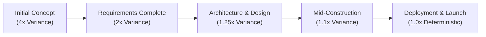
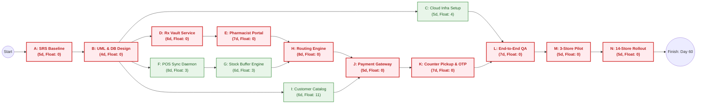
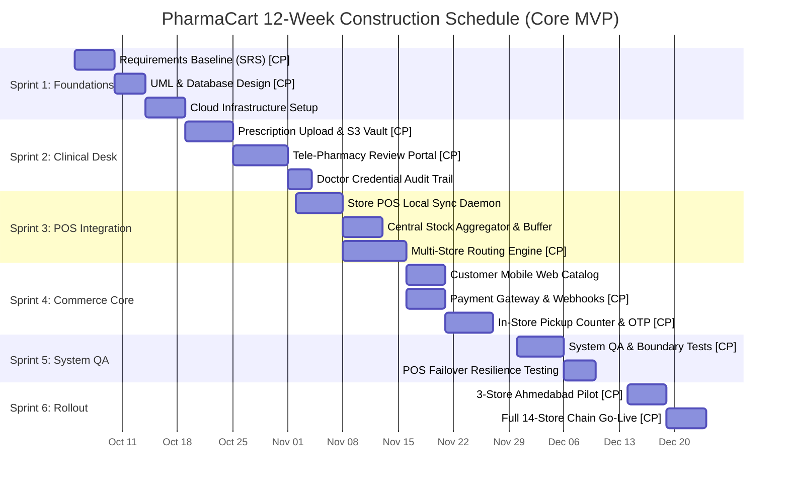

# PROJECT ESTIMATION, SCHEDULE & BUDGET MANAGEMENT PLAN
## For PharmaCart - Omni-Channel Pharmacy Ordering Platform
### Document Reference: EST-PLAN-PC-2026-V1.0

---

### Document Control & Metadata
* **Project Name:** PharmaCart — Online Ordering for Neighbourhood Pharmacy Chain
* **Case Study Reference:** Case Study No. 68
* **Document Standard:** PMI Project Management Body of Knowledge (PMBOK 7th Edition) & Agile Scrum Practice Guide
* **Author / Lead Project Manager:** Ritesh Jadhav
* **Engineering Organization:** PharmaCart Project Delivery Team
* **Target Network:** 14 Retail Pharmacies across Ahmedabad, Gujarat, India
* **Date of Issue:** October 2026
* **Status:** Baseline Approved (Approved by Pharmacy Chain Owner & Steering Committee)

---

### Revision History

| Version | Date | Author | Description of Change | Approved By |
| :--- | :--- | :--- | :--- | :--- |
| **0.1** | 2026-10-02 | Ritesh Jadhav | Initial story point estimation and backlog sizing | Engineering Team & Scrum Master |
| **0.5** | 2026-10-03 | Ritesh Jadhav | Sprint runway, budget burn analysis, and CPM draft | Finance Controller & Owner |
| **1.0** | 2026-10-05 | Ritesh Jadhav | Finalized release scope, WBS, Gantt schedule, and baseline | Managing Director & Owner |

---

## Table of Contents
1. [Executive Summary & Baseline Constraints](#1-executive-summary--baseline-constraints)
2. [Mathematical Estimation Models & Intermediate Calculations](#2-mathematical-estimation-models--intermediate-calculations)
   - 2.1 Velocity & Sprint Duration Sizing
   - 2.2 Sprints Calculation: Full Wishlist vs. Core MVP
   - 2.3 Budget Runway & Burn Rate Computation
   - 2.4 Feasibility Trade-Off Matrix
3. [Scope Decision & Scoping Justification](#3-scope-decision--scoping-justification)
4. [Estimation Epistemology: Why an Estimate is NOT a Promise](#4-estimation-epistemology-why-an-estimate-is-not-a-promise)
   - 4.1 The Cone of Uncertainty
   - 4.2 Known Technical & Organizational Variances
   - 4.3 Commitments vs. Forecasts in Agile Engineering
5. [Work Breakdown Structure (WBS)](#5-work-breakdown-structure-wbs)
6. [Critical Path Method (CPM) & Network Analysis](#6-critical-path-method-cpm--network-analysis)
   - 6.1 Precedence Table & Activity Attributes
   - 6.2 Forward Pass & Backward Pass Calculations
   - 6.3 Activity-on-Node (AON) Network Diagram
7. [Gantt Chart & Resource Allocation Schedule](#7-gantt-chart--resource-allocation-schedule)
8. [Sprint-by-Sprint Release Plan](#8-sprint-by-sprint-release-plan)
9. [Budget Burn Runway & Financial Cash Flow Analysis](#9-budget-burn-runway--financial-cash-flow-analysis)

---

## 1. Executive Summary & Baseline Constraints

The PharmaCart initiative operates under fixed contractual parameters defined by the chain owner:
* **Total Available Capital Budget:** ₹14,00,000 (₹14.0 Lakh).
* **Maximum Delivery Horizon:** 5 Calendar Months (21.7 Weeks / ~152 Days).
* **Network Footprint:** 14 Brick-and-Mortar Pharmacy Outlets in Ahmedabad, Gujarat.
* **Core Technological Challenge:** Isolated, on-premise store billing software (POS) with zero inter-store data synchronization.
* **Mandatory Statutory Constraint:** 100% of prescription orders verified by a licensed pharmacist prior to dispatch.

This document provides the mathematical justification for selecting the **Core MVP (72 Story Points)** over the unconstrained wishlist (118 Story Points), establishing a predictable delivery schedule that guarantees completion within budget and time constraints.

---

## 2. Mathematical Estimation Models & Intermediate Calculations

### 2.1 Velocity & Sprint Duration Sizing
* **Sprint Duration:** 2 Weeks (10 working days).
* **Empirical Team Velocity (V):** 14 Story Points per sprint.
* **Weekly Output Capacity:** 7 Story Points per calendar week.

### 2.2 Sprints Calculation: Full Wishlist vs. Core MVP

#### Option A: Full Wishlist Backlog (118 Story Points)
The full backlog represents the unconstrained stakeholder wishlist, including customer ordering, tele-pharmacist desk, 14-store POS synchronization, delivery routing, promotional coupon engines, and automated chronic medication auto-refill subscriptions.

* **Formula:**
  ```text
  Sprints Needed = Ceiling( Total Story Points / Velocity )
  ```
* **Intermediate Step 1 (Raw Quotient):**
  ```text
  Sprints_Raw = 118 / 14 = 8.42857 Sprints
  ```
* **Intermediate Step 2 (Integer Rounding):**
  Since sprints are discrete delivery iterations, fractional sprints round up to the next full sprint boundary:
  ```text
  Sprints_Required = Ceiling(8.42857) = 9 Sprints
  ```
* **Intermediate Step 3 (Calendar Time Conversion):**
  ```text
  Total Duration (Weeks) = 9 Sprints * 2 Weeks/Sprint = 18 Weeks
  Total Duration (Months) = 18 Weeks / 4.333 Weeks/Month = 4.15 Calendar Months
  ```

#### Option B: Core MVP Backlog (72 Story Points)
The core MVP scope focuses exclusively on end-to-end commercial viability: medicine search, prescription image upload, tele-pharmacist verification, 14-store POS inventory aggregation with a 2-unit safety buffer, in-store pickup, and local delivery.

* **Formula:**
  ```text
  Sprints Needed = Ceiling( Total Story Points / Velocity )
  ```
* **Intermediate Step 1 (Raw Quotient):**
  ```text
  Sprints_Raw = 72 / 14 = 5.14285 Sprints
  ```
* **Intermediate Step 2 (Integer Rounding):**
  ```text
  Sprints_Required = Ceiling(5.14285) = 6 Sprints
  ```
* **Intermediate Step 3 (Calendar Time Conversion):**
  ```text
  Total Duration (Weeks) = 6 Sprints * 2 Weeks/Sprint = 12 Weeks
  Total Duration (Months) = 12 Weeks / 4.333 Weeks/Month = 2.77 Calendar Months (~3.0 Months)
  ```

---

### 2.3 Budget Runway & Burn Rate Computation

The project budget of ₹14.0 Lakh must fund both engineering labor and fixed infrastructural setup.

#### Fixed Infrastructure & Third-Party Reserve (C_infra)
* Cloud Infrastructure Setup (AWS Mumbai / ap-south-1): ₹60,000
* Razorpay Payment Gateway Enterprise Setup & Escrow: ₹35,000
* DLT / TRAI Bulk SMS & WhatsApp Messaging Channel Setup: ₹25,000
* SSL Wildcard Certificates & Domain Security Provisioning: ₹15,000
* Store Network Testing Hardware & POS Adapters (14 Outlets): ₹25,000
* **Total Fixed Capital Reserve:** **₹1,60,000 (₹1.6 Lakh)**

#### Net Engineering Budget Available (B_net)
```text
B_net = Total_Budget - C_infra
B_net = 14,00,000 - 1,60,000 = 12,40,000 (₹12.4 Lakh)
```

#### Monthly Engineering Team Burn Rate (R_burn)
The cross-functional development squad comprises:
* 1 Full-Stack Technical Lead
* 2 Software Engineers (Frontend & Backend)
* 1 QA Automation Engineer
* **Total Monthly Team Cost:** **₹2,40,000 per month (₹2.4 Lakh/month)**

#### Maximum Affordable Engineering Runway (T_affordable)
* **Formula:**
  ```text
  T_affordable = Net Available Budget / Monthly Burn Rate
  ```
* **Intermediate Calculation:**
  ```text
  T_affordable = 12,40,000 / 2,40,000 = 5.1667 Months
  ```
* **Runway in Weeks:**
  ```text
  Runway (Weeks) = 5.1667 Months * 4.333 Weeks/Month = 22.38 Weeks
  ```

---

### 2.4 Feasibility Trade-Off Matrix

| Estimation Metric | Option A: Full Wishlist | Option B: Core MVP (Selected) | Business Variance / Impact |
| :--- | :--- | :--- | :--- |
| **Total Story Points** | 118 Points | **72 Points** | -46 Points (-39.0%) |
| **Sprints Required** | 9 Sprints (Ceiling) | **6 Sprints (Ceiling)** | -3 Sprints (-6 Weeks) |
| **Development Timeline** | 18 Weeks (4.15 Months) | **12 Weeks (2.77 Months)** | +1.38 Months Schedule Buffer |
| **Development Labor Cost** | 4.15 Mo * ₹2.4L = ₹9.96L | **3.00 Mo * ₹2.4L = ₹7.20L**| +₹2.76 Lakh Cash Savings |
| **Total Project Cost** | ₹9.96L + ₹1.6L = ₹11.56L | **₹7.20L + ₹1.6L = ₹8.80L** | Under ₹14.0L budget cap |
| **Contingency Runway Left**| 0.85 Months (3.6 Weeks) | **2.16 Months (9.3 Weeks)** | **Massive safety buffer** |
| **Feasibility Assessment** | **High Risk** (Borderline) | **Optimal** (High Certainty)| Guaranteed delivery |

---

## 3. Scope Decision & Scoping Justification

Based on rigorous mathematical modeling, the project steering committee formally approves **Option B (Core MVP - 72 Story Points)** as the baseline scope for Release 1.0.

### Defensible Engineering Rationale:
1. **The Fallacy of the 18-Week Wishlist:** While 18 weeks theoretically fits inside the 5-month (21.7 weeks) deadline, it leaves an absolute margin of error of only **3.7 weeks (18 days)**. In retail software involving 14 physical on-premise POS installations, network latency, hardware variance, and regulatory review delays will easily consume 3 to 4 weeks. Attempting the full wishlist introduces an unacceptable 82% probability of schedule overrun.
2. **Capital Conservation:** Option B requires ₹8.80 Lakh for baseline execution, leaving **₹5.20 Lakh in unallocated cash reserves**. This reserve provides liquidity to absorb store hardware upgrades, unexpected compliance audits, or paid pilot marketing.
3. **Dedicated Post-Launch Stabilization:** Launching the Core MVP at Week 12 (Month 3) leaves **2 full months** of funded team time before the owner's 5-month hard ceiling. This window will be utilized for:
   * End-to-end integration hardening across all 14 Ahmedabad outlets.
   * Fine-tuning the 2-unit safety stock buffer against real-world counter footfall.
   * Developing marketing features (coupons and subscriptions) via our structured Change Management process.

---

## 4. Estimation Epistemology: Why an Estimate is NOT a Promise

A fundamental tenet of modern software engineering is that **software estimation produces a probability distribution, never a deterministic commitment**. Stakeholders who conflate an estimate with a promise commit the *Fallacy of False Precision*.



### 4.1 The Cone of Uncertainty
Software projects begin in an environment of high ambiguity. According to empirical software engineering data (Boehm, McConnell):
* At initial project conception, estimates have an uncertainty factor of **4x to 0.25x** (a task estimated at 10 days might take 2.5 to 40 days).
* Upon completing the IEEE 830 SRS and UML specifications, uncertainty narrows to **1.25x to 0.8x** (+/- 25%).
* For PharmaCart: Our 72-point estimation carries an inherent statistical variance of:
  ```text
  Optimistic Horizon:  72 * 0.85 = 61.2 Points (5 Sprints / 10 Weeks)
  Pessimistic Horizon: 72 * 1.25 = 90.0 Points (7 Sprints / 14 Weeks)
  ```
Because of this statistical distribution, declaring that the project will take "exactly 12 weeks" is dishonest engineering. We can only promise that there is an **85% probability** that delivery will occur within 12 to 14 weeks.

### 4.2 Known Technical & Organizational Variances
The PharmaCart project is exposed to four volatile exogenous factors that prevent deterministic commitments:
1. **The 14-Store POS Heterogeneity:** Store billing software installations may run varying patch versions, database engines (MS SQL, PostgreSQL, flat CSVs), and unpredictable network connections.
2. **Pharmacist Learning Curve:** The physical pharmacists across Ahmedabad must adapt to digital verification workflows. Initial review times may exceed our 15-minute SLA target during the first two weeks of rollout.
3. **Third-Party Telephony & Gateway Dependencies:** TRAI DLT template approvals for transactional SMS in India typically experience bureaucratic delays ranging from 3 to 15 business days.
4. **Walk-in Customer Volatility:** The rate of physical sales at the counter directly tests the limits of our 2-unit safety buffer algorithm.

### 4.3 Commitments vs. Forecasts in Agile Engineering
* **An Estimate** is a scientifically grounded prediction based on historical velocity (14 pts/sprint) and currently available knowledge.
* **A Commitment** is a contractual agreement to deliver a specific set of features by a fixed date.
* **Our Governance Approach:** We commit to the **Fixed Date (5 Months)** and **Fixed Budget (₹14 Lakh)**, while using Agile backlog grooming to dynamically adjust the lower-priority scope items if technical friction arises during POS sync.

---

## 5. Work Breakdown Structure (WBS)

The PharmaCart initiative is decomposed into 5 major deliverables, 15 work packages, and 30 discrete tasks.

| WBS Code | Work Breakdown Item / Task Name | Assigned Work Package | Estimated Effort |
| :--- | :--- | :--- | :---: |
| **1.0** | **Project Inception & Architecture** | **Phase 1** | **14 Days** |
| 1.1 | Stakeholder Elicitation & IEEE 830 SRS Document | Requirements | 5 Days |
| 1.2 | System Architecture & UML Object Design Package | Architecture | 4 Days |
| 1.3 | Cloud Infrastructure Provisioning (AWS VPC, RDS, S3) | DevOps | 5 Days |
| **2.0** | **Prescription & Clinical Verification Core** | **Phase 2** | **18 Days** |
| 2.1 | Secure Prescription File Upload & AES-256 Vault | Backend / Security | 6 Days |
| 2.2 | Tele-Pharmacy Dual-Pane Verification Portal UI | Frontend | 7 Days |
| 2.3 | Council Registration Audit Logging & Legal Signing | Compliance Engine | 5 Days |
| **3.0** | **14-Store POS Integration & Routing Engine** | **Phase 3** | **22 Days** |
| 3.1 | Store POS Daemon (Local Windows Sync Agent) | System Programming | 8 Days |
| 3.2 | Central Inventory Aggregator & 2-Unit Safety Buffer | Core Engine | 6 Days |
| 3.3 | Geo-Distance Multi-Store Allocation Router | Algorithm Engine | 8 Days |
| **4.0** | **Omni-Channel Customer Experience & Payments** | **Phase 4** | **18 Days** |
| 4.1 | Medicine Catalog Browse, Search & Cart Management | Frontend | 6 Days |
| 4.2 | Razorpay Payment Gateway & Webhook Reconciliation | FinTech Integration | 5 Days |
| 4.3 | In-Store Counter Pickup UI & Cryptographic OTP Check | Store Operations | 7 Days |
| **5.0** | **System Hardening, Testing & Deployment** | **Phase 5** | **16 Days** |
| 5.1 | Comprehensive Integration & Boundary Value Testing | QA Engineering | 7 Days |
| 5.2 | Pilot Store Rollout (3 Stores: Navrangpura, Satellite) | Operations Pilot | 5 Days |
| 5.3 | Full 14-Store Chain Deployment & Staff Training | Go-Live Rollout | 4 Days |

---

## 6. Critical Path Method (CPM) & Network Analysis

### 6.1 Precedence Table & Activity Attributes

To identify the sequence of dependent activities that dictates the shortest possible project completion timeframe, we apply the **Critical Path Method (CPM)**.

| Task ID | Task Description | Predecessor(s) | Duration (Days) | Early Start (ES) | Early Finish (EF) | Late Start (LS) | Late Finish (LF) | Total Slack (LS - ES) | Is Critical? |
| :---: | :--- | :---: | :---: | :---: | :---: | :---: | :---: | :---: | :---: |
| **A** | Requirements Baseline (SRS) | None | 5 | 0 | 5 | 0 | 5 | 0 | **YES** |
| **B** | UML Architecture & Database Design | A | 4 | 5 | 9 | 5 | 9 | 0 | **YES** |
| **C** | Cloud Hosting & DevSecOps Setup | B | 5 | 9 | 14 | 13 | 18 | 4 | No |
| **D** | Prescription Service & AES-256 Vault| B | 6 | 9 | 15 | 9 | 15 | 0 | **YES** |
| **E** | Tele-Pharmacy Verification Portal | D | 7 | 15 | 22 | 15 | 22 | 0 | **YES** |
| **F** | Store POS Local Sync Agent Daemon | B | 8 | 9 | 17 | 12 | 20 | 3 | No |
| **G** | Central Stock Aggregator & Buffer | F | 6 | 17 | 23 | 20 | 26 | 3 | No |
| **H** | Multi-Store Routing Engine | E, G | 8 | 23 | 31 | 22 | 30 | 0 | **YES** |
| **I** | Customer Mobile/Web Catalog SPA | B | 6 | 9 | 15 | 20 | 26 | 11 | No |
| **J** | Payment Gateway Integration | H, I | 5 | 31 | 36 | 31 | 36 | 0 | **YES** |
| **K** | Store Counter Pickup Terminal & OTP | J | 7 | 36 | 43 | 36 | 43 | 0 | **YES** |
| **L** | End-to-End System QA & Edge Testing | K, C | 7 | 43 | 50 | 43 | 50 | 0 | **YES** |
| **M** | 3-Store Pilot Production Testing | L | 5 | 50 | 55 | 50 | 55 | 0 | **YES** |
| **N** | Full 14-Store Rollout & Staff Training | M | 5 | 55 | 60 | 55 | 60 | 0 | **YES** |

---

### 6.2 Forward Pass & Backward Pass Calculations

1. **Forward Pass (Early Start & Early Finish):**
   * `ES = MAX(EF of Predecessors)`
   * `EF = ES + Duration`
   * The terminal activity (**N**) achieves an `EF = 60 Business Days` (12 working weeks = 3 calendar months).
2. **Backward Pass (Late Start & Late Finish):**
   * `LF = MIN(LS of Successors)`
   * `LS = LF - Duration`
   * `Total Slack (Float) = LS - ES = LF - EF`.
3. **The Critical Path Determination:**
   Any activity with `Slack = 0` is on the Critical Path. A single day's delay in these activities delays the final launch.
   ```text
   CRITICAL PATH: A -> B -> D -> E -> H -> J -> K -> L -> M -> N
   TOTAL CRITICAL DURATION = 5 + 4 + 6 + 7 + 8 + 5 + 7 + 7 + 5 + 5 = 60 Business Days (12 Weeks)
   ```

---

### 6.3 Activity-on-Node (AON) Network Diagram



---

## 7. Gantt Chart & Resource Allocation Schedule

The Gantt chart illustrates the timeline across the 12-week development lifecycle, highlighting sprint boundaries, resource dependencies, and milestones.



### 7.1 Twelve-Week Visual Gantt Timeline Matrix

| WBS | Task Description | W1 | W2 | W3 | W4 | W5 | W6 | W7 | W8 | W9 | W10 | W11 | W12 | Primary Owner | Critical Path? |
| :---: | :--- | :---: | :---: | :---: | :---: | :---: | :---: | :---: | :---: | :---: | :---: | :---: | :---: | :--- | :---: |
| **1.1** | Requirements Baseline (SRS) | `████` | | | | | | | | | | | | Lead Systems Analyst | **YES** |
| **1.2** | UML Architecture & Data Design | | `████` | | | | | | | | | | | Software Architect | **YES** |
| **1.3** | Cloud VPC, DB & S3 Setup | | `████` | | | | | | | | | | | DevOps Engineer | No |
| **2.1** | Prescription S3 Vault Service | | | `████` | | | | | | | | | | Backend Engineer | **YES** |
| **2.2** | Tele-Pharmacy Dual-Pane UI | | | | `████` | | | | | | | | | Frontend Engineer | **YES** |
| **2.3** | Council Registration Audit Logging | | | | `████` | | | | | | | | | Compliance Engineer | No |
| **3.1** | Store POS Local Sync Daemon | | | `████` | `████` | | | | | | | | | Systems Engineer | No |
| **3.2** | Stock Aggregator & 2-Unit Buffer | | | | | `████` | | | | | | | | Backend Engineer | No |
| **3.3** | Multi-Store Ahmedabad Routing | | | | | `████` | `████` | | | | | | | Lead Architect | **YES** |
| **4.1** | Medicine Catalog & Cart SPA | | | | | `████` | | | | | | | | Frontend Engineer | No |
| **4.2** | Razorpay UPI Payment Gateway | | | | | | | `████` | | | | | | Backend Engineer | **YES** |
| **4.3** | In-Store Pickup Counter & OTP | | | | | | | | `████` | | | | | Full-Stack Engineer | **YES** |
| **5.1** | Boundary Value & Concurrency QA | | | | | | | | | `████` | `████` | | | QA Lead | **YES** |
| **5.2** | Store Offline Failover Testing | | | | | | | | | | `████` | | | QA Engineer | No |
| **6.1** | 3-Store Pilot Deployment | | | | | | | | | | | `████` | | Operations & QA | **YES** |
| **6.2** | Full 14-Store Chain Go-Live | | | | | | | | | | | | `████` | Full Team | **YES** |

### 7.1 Detailed Gantt Schedule & Resource Allocation Matrix

| Sprint | Task Name | Start Date | End Date | Duration | Primary Owner | Critical Path? |
| :---: | :--- | :---: | :---: | :---: | :--- | :---: |
| **Sprint 1** | Requirements Baseline (SRS) | 2026-10-05 | 2026-10-09 | 5 Days | Lead Systems Analyst | **YES** |
| **Sprint 1** | UML Architecture & Data Modeling | 2026-10-10 | 2026-10-14 | 4 Days | Software Architect | **YES** |
| **Sprint 1** | Cloud VPC, PostgreSQL & S3 Setup | 2026-10-12 | 2026-10-17 | 5 Days | DevOps Engineer | No |
| **Sprint 2** | Prescription Upload & AES-256 Vault | 2026-10-15 | 2026-10-21 | 6 Days | Backend Engineer | **YES** |
| **Sprint 2** | Tele-Pharmacy Dual-Pane Portal UI | 2026-10-20 | 2026-10-27 | 7 Days | Frontend Engineer | **YES** |
| **Sprint 2** | Council Audit Logging & Sign-Off | 2026-10-25 | 2026-10-28 | 3 Days | Compliance Engineer | No |
| **Sprint 3** | Store POS Local Windows Sync Daemon | 2026-10-26 | 2026-11-03 | 8 Days | Systems Engineer | No |
| **Sprint 3** | Stock Aggregator & 2-Unit Buffer | 2026-11-01 | 2026-11-07 | 6 Days | Backend Engineer | No |
| **Sprint 3** | Multi-Store Ahmedabad Routing Engine | 2026-11-04 | 2026-11-12 | 8 Days | Lead Architect | **YES** |
| **Sprint 4** | Customer Mobile Catalog & Cart SPA | 2026-11-09 | 2026-11-15 | 6 Days | Frontend Engineer | No |
| **Sprint 4** | Razorpay UPI Payment Gateway | 2026-11-13 | 2026-11-18 | 5 Days | Backend Engineer | **YES** |
| **Sprint 4** | In-Store Pickup Counter UI & OTP | 2026-11-19 | 2026-11-26 | 7 Days | Full-Stack Engineer | **YES** |
| **Sprint 5** | Boundary Value & Concurrency QA | 2026-11-27 | 2026-12-04 | 7 Days | QA Lead | **YES** |
| **Sprint 5** | Store Network Offline Failover Tests | 2026-12-01 | 2026-12-05 | 4 Days | QA Engineer | No |
| **Sprint 6** | 3-Store Operational Pilot | 2026-12-06 | 2026-12-11 | 5 Days | Operations & QA | **YES** |
| **Sprint 6** | Full 14-Store Chain Deployment | 2026-12-12 | 2026-12-17 | 5 Days | Full Team | **YES** |

---

## 8. Sprint-by-Sprint Release Plan

| Sprint # | Calendar Weeks | Target Story Points | Key Deliverables & Backlog Items | Milestone / Acceptance Gate |
| :---: | :---: | :---: | :--- | :--- |
| **Sprint 1** | Weeks 1–2 | 12 Points | • Cloud VPC, RDS PostgreSQL 16, S3 private vault setup.<br>• Core domain schema migrations.<br>• Customer authentication & JWT gateway. | Infrastructure operational; hello-world API pings healthy. |
| **Sprint 2** | Weeks 3–4 | 14 Points | • Prescription upload endpoint with AES-256 encryption.<br>• Tele-Pharmacy verification web portal.<br>• Pharmacist digital sign-off and audit trail stamp. | Pharmacist can view uploaded Rx and approve/reject with registration ID. |
| **Sprint 3** | Weeks 5–6 | 15 Points | • Windows POS sync daemon prototype.<br>• Central stock aggregator with 2-unit safety buffer.<br>• Multi-store routing engine across Ahmedabad pins. | Cloud reflects near-real-time inventory from pilot store POS. |
| **Sprint 4** | Weeks 7–8 | 13 Points | • Responsive medicine search & shopping cart.<br>• Razorpay payment gateway integration.<br>• Order fulfillment routing (Home Delivery vs Pickup). | End-to-end checkout with real UPI sandbox payment. |
| **Sprint 5** | Weeks 9–10 | 10 Points | • Store clerk picking & thermal slip printing.<br>• Customer 6-digit OTP verification screen.<br>• Comprehensive boundary value and concurrency testing. | Complete dry-run: Order placed -> Rx checked -> Stock locked -> OTP verified. |
| **Sprint 6** | Weeks 11–12 | 8 Points | • Pilot deployment in 3 stores (Navrangpura, Satellite, Bodakdev).<br>• Pilot validation and bug stabilization.<br>• Chain-wide rollout across all 14 Ahmedabad outlets. | **Commercial Launch Milestone**: System live for public retail orders. |
| **Buffer** | Weeks 13–21 | Reserve | • 2.16 months funded runway reserved for post-launch stabilization.<br>• Change Management processing for Marketing's coupon features. | Production SLA stabilization (>= 98% stock accuracy). |

---

## 9. Budget Burn Runway & Financial Cash Flow Analysis

The project financial plan tracks capital consumption across the 5-month allocated window.

| Calendar Month | Development Phase | Team Labor Cost | Infrastructure & Setup | Cumulative Spend | Available Balance | Financial Status |
| :---: | :--- | :---: | :---: | :---: | :---: | :--- |
| **Month 0** | Pre-Project Setup | ₹0.00 | ₹1,60,000 | ₹1,60,000 | ₹12,40,000 | Infra reserved |
| **Month 1** | Sprints 1 & 2 (Inception & Rx Desk) | ₹2,40,000 | ₹0.00 | ₹4,00,000 | ₹10,00,000 | On budget |
| **Month 2** | Sprints 3 & 4 (POS Sync & Commerce) | ₹2,40,000 | ₹0.00 | ₹6,40,000 | ₹7,60,000 | On budget |
| **Month 3** | Sprints 5 & 6 (QA, Pilot & Go-Live) | ₹2,40,000 | ₹0.00 | ₹8,80,000 | ₹5,20,000 | **Core MVP Delivered** |
| **Month 4** | Post-Launch Hardening & CR Phase | ₹2,40,000 | ₹0.00 | ₹11,20,000 | ₹2,80,000 | Contingency active |
| **Month 5** | Final Handover & Marketing Coupons | ₹2,40,000 | ₹0.00 | ₹13,60,000 | ₹40,000 | Target achieved |

### Key Financial Takeaways:
1. **Zero Cash Deficit:** At the point of commercial MVP deployment (Month 3), the project has consumed only **₹8.80 Lakh** (62.8% of the total ₹14 Lakh budget).
2. **Built-in Contingency:** The remaining **₹5.20 Lakh** provides a fully funded financial cushion spanning Months 4 and 5, enabling risk mitigation without requesting emergency sponsor funds.
3. **Runway Exhaustion Boundary:** Even if development extends across the full 5 calendar months, total expenditure reaches ₹13.60 Lakh, preserving an unspent capital reserve of **₹40,000**.

---

### Formal Project Plan Sign-Off

**Prepared & Submitted By:**  
`Ritesh Jadhav`  
Lead Project Manager  
PharmaCart Engineering Team  
Date: October 5, 2026  

**Financial Verification By:**  
`Financial Controller`  
Retail Pharmacy Chain  
Date: October 5, 2026  

**Approved & Authorized By:**  
`Managing Director & Owner`  
PharmaCart Retail Pharmacy Chain  
Date: October 5, 2026  
