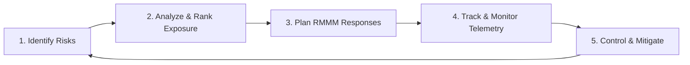
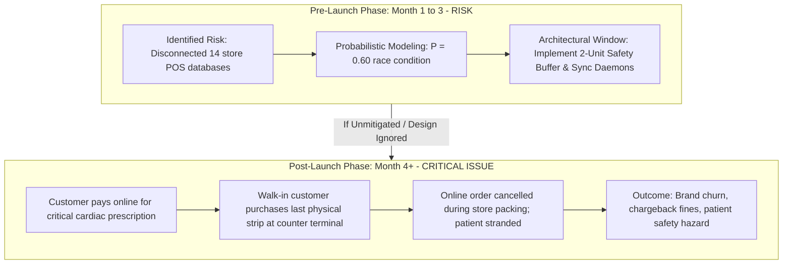
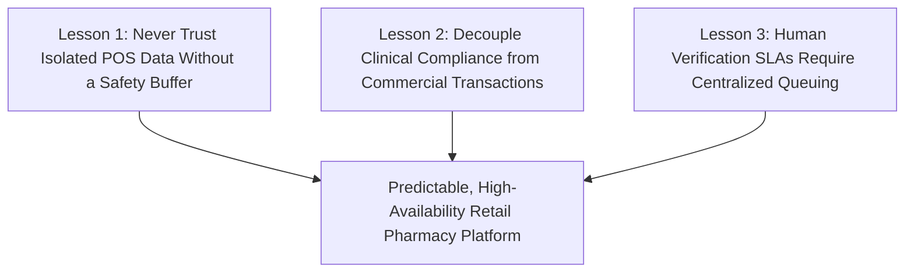

# RISK MANAGEMENT PLAN, REGISTER & RMMM SPECIFICATION
## For PharmaCart - Omni-Channel Pharmacy Ordering Platform
### Document Reference: RISK-RMMM-PC-2026-V1.0

---

### Document Control & Metadata
* **Project Name:** PharmaCart — Online Ordering for Neighbourhood Pharmacy Chain
* **Case Study Reference:** Case Study No. 68
* **Document Standard:** ISO 31000:2018 (Risk Management Guidelines) & Software Engineering Institute (SEI) RMMM Model
* **Author / Lead Risk Manager & Architect:** Ritesh Jadhav
* **Engineering Organization:** PharmaCart Project Delivery Team
* **Target Network:** 14 Retail Pharmacies across Ahmedabad, Gujarat, India
* **Date of Issue:** October 2026
* **Status:** Baseline Approved (Approved by Managing Director & Head Pharmacist)

---

### Revision History

| Version | Date | Author | Description of Change | Approved By |
| :--- | :--- | :--- | :--- | :--- |
| **0.1** | 2026-10-02 | Ritesh Jadhav | Initial risk identification from stakeholder workshop | Project Delivery Lead |
| **0.7** | 2026-10-04 | Ritesh Jadhav | Quantified P*I exposure scores and drafted RMMM actions | Head Pharmacist-in-Charge |
| **1.0** | 2026-10-05 | Ritesh Jadhav | Finalized risk register, risk vs. issue analysis, and closure notes | Managing Director & Owner |

---

## Table of Contents
1. [Risk Management Strategy & Methodology](#1-risk-management-strategy--methodology)
2. [Quantitative Risk Register & Exposure Ranking](#2-quantitative-risk-register--exposure-ranking)
   - 2.1 The Exposure Formula (Exposure = P * I)
   - 2.2 Exposure-Ranked Risk Register
   - 2.3 Probability-Impact (P-I) Heatmap Matrix
3. [Deep-Dive Analysis: Risk vs. Issue Transformation](#3-deep-dive-analysis-risk-vs-issue-transformation)
   - 3.1 Epistemological Boundary: Risk Today vs. Issue Tomorrow
   - 3.2 The Lifecycle of the 'Stock Mismatch' Vulnerability
   - 3.3 Cascading Post-Launch Failure Modes
4. [Detailed RMMM Plans for the Top Three Risks](#4-detailed-rmmm-plans-for-the-top-three-risks)
   - 4.1 Risk #1: Stock Mismatch Causing Cancelled Orders (Exposure = 4.2)
   - 4.2 Risk #2: Prescription-Check Verification Delays (Exposure = 2.4)
   - 4.3 Risk #3: Coupon Misuse & Promotional Fraud (Exposure = 1.2)
5. [Monitoring Plan for Risk #4: Regulatory Complaint](#5-monitoring-plan-for-risk-4-regulatory-complaint)
6. [Risk Closure Note & Engineering Lessons Learned](#6-risk-closure-note--engineering-lessons-learned)

---

## 1. Risk Management Strategy & Methodology

The PharmaCart platform operates at the intersection of strict healthcare statutory compliance and complex retail inventory logistics across 14 fragmented Ahmedabad outlets. The risk strategy follows the **Continuous Risk Management (CRM)** paradigm developed by the Software Engineering Institute (SEI):



Every project uncertainty is formally assessed against:
1. **Probability (P):** Likelihood of the risk event occurring, normalized on a decimal scale from 0.0 (impossible) to 1.0 (certain).
2. **Impact (I):** Severity of consequences to business operations, financials, statutory compliance, or customer safety, rated on a discrete integer scale from 1 (negligible) to 10 (catastrophic).
3. **Risk Exposure (RE):** Calculated mathematical product ranking the relative urgency of the risk.

---

## 2. Quantitative Risk Register & Exposure Ranking

### 2.1 The Exposure Formula
To eliminate subjective prioritization, risks are prioritized using the quantitative Risk Exposure formula:
```text
Risk Exposure (RE) = Probability (P) * Impact (I)
```

### 2.2 Exposure-Ranked Risk Register

The four primary risks defined in Case Study No. 68 are evaluated, computed, and ranked below:

| Risk ID | Risk Title & Description | Probability (P) | Impact (I) | Risk Exposure (P * I) | Priority Rank | Risk Category | Designated Risk Owner |
| :---: | :--- | :---: | :---: | :---: | :---: | :--- | :--- |
| **RSK-01** | **Stock mismatch causing cancelled orders:** Disconnected store billing systems cause orders to be accepted for medicines physically sold out to walk-in counter customers. | **0.6** | **7** | **4.2** | **Rank #1 (Highest)** | Operational / Architecture | Lead Backend Architect & Retail Ops Manager |
| **RSK-02** | **Prescription-check delays:** High order volume overwhelms on-duty pharmacists, violating the 15-minute verification SLA and delaying packing/dispatch. | **0.4** | **6** | **2.4** | **Rank #2** | Process / Clinical SLA | Head Pharmacist-in-Charge |
| **RSK-03** | **Coupon misuse & promotional fraud:** Loopholes in coupon validation allow repeated redemptions or unauthorized discounts on regulated prescription drugs. | **0.3** | **4** | **1.2** | **Rank #3** | Financial / Fraud | Security Engineer & Marketing Coordinator |
| **RSK-04** | **Regulatory complaint (FDA/DCI):** Inadvertent dispatch of Schedule H/X drug without certified verification or doctor seal, causing non-bailable regulatory sanctions. | **0.1** | **10** | **1.0** | **Rank #4** | Statutory / Legal | Chief Compliance Officer & Owner |

---

### 2.3 Probability-Impact (P-I) Heatmap Matrix

The heatmap below maps the four project risks into severity zones, dictating management attention.

| Probability (P) | Low Impact (1 - 3) | Moderate Impact (4 - 6) | High Impact (7 - 8) | Critical Impact (9 - 10) |
| :---: | :---: | :---: | :---: | :---: |
| **High (0.6 - 1.0)** | Unassigned | Unassigned | **RSK-01: Stock Mismatch**<br>(P=0.6, I=7 -> **4.2**)<br>*CRITICAL ATTENTION* | Unassigned |
| **Medium (0.3 - 0.5)** | Unassigned | **RSK-02: Rx Verification Delay**<br>(P=0.4, I=6 -> **2.4**)<br>**RSK-03: Coupon Misuse**<br>(P=0.3, I=4 -> **1.2**) | Unassigned | Unassigned |
| **Low (0.0 - 0.2)** | Unassigned | Unassigned | Unassigned | **RSK-04: Regulatory Breach**<br>(P=0.1, I=10 -> **1.0**)<br>*EXISTENTIAL THREAT* |

---

## 3. Deep-Dive Analysis: Risk vs. Issue Transformation

A mandatory analytical outcome of Case Study No. 68 is explaining **why stock mismatch is a RISK today during development, but becomes an catastrophic ISSUE after launch if left unresolved**.

### 3.1 Epistemological Boundary: Risk Today vs. Issue Tomorrow

| Dimension | Risk State (During Development) | Issue State (After Commercial Launch) |
| :--- | :--- | :--- |
| **Definition** | An **uncertain future event** that may or may not occur (0 < P < 1.0). | A **certain, realized event** currently causing operational damage (P = 1.0). |
| **Probability** | P = 0.60 (Probabilistic vulnerability). | P = 1.00 (Active daily failure). |
| **Financial Cost** | Low: Requires developer hours to code buffer logic and sync daemons. | High: Revenue refunds, cancelled order fees, customer acquisition waste. |
| **Time Horizon** | Forward-looking: Can be architecturally prevented before code deployment. | Backward/Present-looking: Must be firefightingly contained after damage occurs. |
| **Primary Tool** | Architectural modeling, algorithmic safety buffers, stress testing. | Crisis management, customer support escalations, manual stock audits. |

---

### 3.2 The Lifecycle of the 'Stock Mismatch' Vulnerability



1. **The Current State (Development Phase):**
   * Today, the 14 Ahmedabad pharmacies operate normally as physical stores. The software is in development.
   * "Stock mismatch" does not exist as an operational fact yet because no customer can order online. It is purely a **Risk**—a foreseeable architectural vulnerability stemming from the fact that Store #04 in Navrangpura does not sync inventory with the central cloud.
   * If the engineering team addresses this now by writing the `ReservationManager` and the `StoreSyncDaemon`, the risk is neutralized before a single rupee of revenue is endangered.

2. **The Transformed State (Post-Launch Phase):**
   * If the system is deployed without solving this vulnerability, the probabilistic risk instantly converts into an **Active Issue (Incident)**.
   * When an online customer in Satellite places an order for Metformin, pays ₹450 via UPI, and receives an order confirmation, an immutable contract is created.
   * Ten minutes later, a physical walk-in customer at the store counter buys that exact medication. The store clerk scans it on the isolated billing terminal and hands it over.
   * When the online fulfillment clerk prints the packing slip, the shelf is bare. The store has zero units.
   * **The Reality:** The system is forced to unilaterally cancel a paid order for critical prescription medication.

### 3.3 Cascading Post-Launch Failure Modes
If stock mismatch becomes an issue in production, it triggers four cascading business catastrophes:
1. **Severe Patient Health Hazard:** In emergency or chronic illnesses (insulin, hypertension, cardiac drugs), an unexpected order cancellation leaves patients stranded without medication.
2. **Permanent Brand Churn:** Retail pharmacy is an intensely competitive local market. An online customer whose order is cancelled will immediately uninstall PharmaCart and purchase from 1mg, Apollo 24/7, or a local competitor.
3. **Financial Losses from Payment Gateway Reversals:** Payment aggregators (Razorpay) charge non-refundable processing fees (1.8% to 2.0%) on transactions. Repeated refunds consume operating margins without generating revenue.
4. **Wasted Logistics Overhead:** If delivery runners are dispatched to a store only to find the item out of stock, courier transit costs and fuel are completely wasted.

---

## 4. Detailed RMMM Plans for the Top Three Risks

The top three risks carry comprehensive, owned **Risk Mitigation, Monitoring, and Management (RMMM)** plans designed to ensure operational reliability.

---

### 4.1 Risk #1: Stock Mismatch Causing Cancelled Orders (Exposure = 4.2)
* **Core Vulnerability:** Disconnected on-premise store billing software (POS) does not share stock balances with the cloud platform, creating shelf-vs-cloud race conditions with physical counter walk-ins.

#### 1. Risk Mitigation (Proactive Engineering Prevention):
* **Automated Safety Stock Buffer:** Enforce an algorithmic rule across the entire catalog:
  ```text
  Effective_Available_Stock = MAX(0, Physical_POS_Stock - Safety_Buffer)
  ```
  Where `Safety_Buffer = 2 units` by default (configurable up to 5 units for high-velocity SKUs like Paracetamol or Azithromycin). If a store has <= 2 units on its physical shelf, the online app displays "Out of Stock" for that branch, reserving remaining inventory for walk-in counter customers.
* **30-Minute Soft Reservation Hold:** When a customer initiates checkout, the cloud broker immediately issues a cryptographic reservation lock holding those items for 30 minutes. If the customer does not complete payment within 30 minutes, the hold expires and restores online availability.
* **Lightweight Local POS Sync Daemon:** Deploy a background Windows Service on counter terminals in all 14 Ahmedabad stores. The daemon reads local transaction logs every 30 seconds and pushes delta stock decrements to the cloud via outbound WebSocket connections.
* **Sister-Store Automatic Re-Routing:** If a customer's designated branch experiences an unexpected stockout, the `RoutingEngine` automatically evaluates the remaining 13 Ahmedabad stores, identifies the closest branch possessing 100% stock, and re-routes fulfillment seamlessly.

#### 2. Risk Monitoring (Real-Time Telemetry & Early Warning):
* **Cloud Stockout Anomaly Dashboard:** A real-time Grafana dashboard monitoring the **Stock Accuracy Rate (%)**:
  ```text
  Stock Accuracy Rate = [ 1 - (Cancelled Orders due to Stockout / Total Orders Placed) ] * 100
  ```
* **Early Warning Thresholds:**
  * *Amber Alert:* If store-to-cloud sync latency exceeds 60 seconds for > 2 stores.
  * *Red Alert:* If daily order cancellation rate exceeds **1.5%** of total volume. Triggers automated Slack alerts to the Lead Architect and Retail Operations Manager.

#### 3. Risk Management (Reactive Contingency & Crisis Response):
* **Immediate Customer Concierge Outreach:** If an order is accepted but found out of stock during shelf picking:
  1. System triggers an automated high-priority SMS and customer support agent callback within 5 minutes.
  2. Customer is offered an instant sister-store delivery at zero additional delivery fee, or a delivery from the central warehouse within 4 hours.
  3. System automatically credits an apology coupon of ₹50 to the customer's digital wallet for their next purchase.
* **Emergency Store Stock Lockout:** If a specific store terminal loses internet connectivity for > 15 minutes, the central cloud automatically pauses online order routing to that store until POS connectivity is verified.
* **Designated Owner:** Lead Backend Architect & Retail Store Operations Manager.

---

### 4.2 Risk #2: Prescription-Check Verification Delays (Exposure = 2.4)
* **Core Vulnerability:** A sudden surge in online prescription orders overwhelms individual store pharmacists, causing review delays that violate the statutory 15-minute SLA and stall dispatch pipelines.

#### 1. Risk Mitigation (Proactive Engineering Prevention):
* **Pooled Central Tele-Pharmacy Queue:** Prescriptions are not locked to the customer's local store. All incoming prescriptions land in a **shared, centralized cloud FIFO queue** accessible by licensed pharmacists across all 14 stores.
* **Optimized Dual-Pane Verification UI:** The verification desk features an ultra-responsive split screen with high-resolution image zoom, automatic contrast enhancement for poor handwriting, and one-click rejection macros (e.g., "Doctor Seal Missing", "Expired Date").
* **Prescription Pre-Validation OCR:** System automatically pre-scans uploaded documents to detect doctor registration numbers and dates, highlighting potential discrepancies before the pharmacist even inspects the image.
* **Staggered Shift Scheduling:** Chain management institutes staggered pharmacist duty shifts to ensure at least 2 certified pharmacists are dedicated exclusively to cloud verification during peak evening hours (17:00 to 21:00 IST).

#### 2. Risk Monitoring (Real-Time Telemetry & Early Warning):
* **Verification Queue SLA Monitor:** Real-time tracking of time elapsed between `PRESCRIPTION_UPLOADED` and `REVIEW_DECISION_RECORDED`.
* **Early Warning Thresholds:**
  * *Amber Alert:* Queue backlog exceeds 10 unreviewed prescriptions or average review time exceeds **10 minutes**.
  * *Red Alert:* Average review time reaches **15 minutes**. System automatically pushes broadcast audio chime alerts to all 14 store POS terminals.

#### 3. Risk Management (Reactive Contingency & Crisis Response):
* **On-Call Pharmacist Surge Routing:** When red alert triggers, the system automatically redirects queue tickets to designated backup pharmacists (e.g., Head Pharmacist or assistant managers) on their mobile tablets.
* **Proactive Customer Transparency Alerts:** If review latency exceeds 15 minutes due to extreme emergency volume, system sends an automated WhatsApp message: *"Our licensed pharmacist is currently reviewing your prescription with special care. Estimated dispatch delay: 10 minutes. Thank you for your patience."*
* **Designated Owner:** Head Pharmacist-in-Charge.

---

### 4.3 Risk #3: Coupon Misuse & Promotional Fraud (Exposure = 1.2)
* **Core Vulnerability:** Promotion codes intended for retail customer acquisition are exploited by unscrupulous users or syndicates via multiple fake accounts, or erroneously applied to reduce statutory drug prices below legal floor margins.

#### 1. Risk Mitigation (Proactive Engineering Prevention):
* **Strict Statutory Schedule Drug Exclusion:** The coupon engine enforces a database-level constraint:
  ```sql
  WHERE medicine.is_prescription_mandatory = FALSE
  ```
  Coupons apply **strictly to OTC products** (vitamins, baby care, sanitizers). Applying discounts to Schedule H/X medications is blocked by software design to eliminate regulatory liability.
* **Multi-Factor Fraud Capping Rules:**
  * Strict limit: Exactly 1 coupon redemption per verified mobile number and device fingerprint.
  * Minimum cart subtotal threshold: **₹500.00** of OTC items.
  * Absolute discount ceiling: Capped at **₹100.00** (or 10% maximum).
* **Cryptographic Single-Use Tokens:** Each coupon redemption generates an immutable usage hash tied to customer account ID and IMEI/Device ID, preventing replay attacks.

#### 2. Risk Monitoring (Real-Time Telemetry & Early Warning):
* **Promotion Burn Velocity Monitor:** Tracks cumulative financial discount burn against the monthly marketing allocation (₹30,000 cap).
* **Early Warning Thresholds:**
  * *Amber Alert:* > 15 coupon redemptions from the same IP subnet or GPS cluster within 1 hour.
  * *Red Alert:* Total coupon burn exceeds ₹2,000 in a single calendar day. System auto-pauses the active coupon code.

#### 3. Risk Management (Reactive Contingency & Crisis Response):
* **Instant Campaign Kill-Switch:** System administrators possess a one-click dashboard toggle (`EMERGENCY_DEACTIVATE_PROMOTIONS`) that immediately deactivates all active discount codes across web and mobile apps.
* **Blacklisting Engine:** Flagged phone numbers and device fingerprints attempting coupon farming are automatically placed in a 30-day fraud quarantine.
* **Designated Owner:** Security Engineer & Marketing Coordinator.

---

## 5. Monitoring Plan for Risk #4: Regulatory Complaint

While Risk #4 carries a low probability (P = 0.1), its impact is existential (I = 10, Risk Exposure = 1.0). A single dispensing violation can result in cancellation of retail drug licenses by the Gujarat Food and Drug Control Administration (FDCA) or non-bailable prosecution under Section 18 of the Drugs and Cosmetics Act.

| Regulatory Dimension | Enforced Software Safeguard | Audit Verification Method |
| :--- | :--- | :--- |
| **No Dispensing Without Rx** | Hard architectural gate: Order cannot transition to `ALLOCATED` state unless signed by a certified pharmacist. | Database check: 100% of Schedule H orders contain non-null `pharmacist_council_reg_id`. |
| **Schedule X Drug Ban** | Schedule X drugs (narcotics) barred from home delivery; pickup requires in-person physical inspection of original paper prescription. | Catalog rule: Delivery option hardcoded to `STORE_PICKUP_ONLY` for Schedule X SKUs. |
| **Mandatory 3-Year Record Retention** | Prescription images, doctor names, and pharmacist signatures written to immutable, append-only storage with SHA-256 hash chaining. | Automated daily cryptographic audit verifying zero record modifications. |
| **Dispensing Label Compliance** | Thermal packing slips automatically print: (1) Patient Name, (2) Doctor Name & Reg No, (3) Dispensing Pharmacist Name & Reg No, (4) Pharmacy Outlet Drug License Number. | Visual inspection during pre-dispatch quality check at counter. |

---

## 6. Risk Closure Note & Engineering Lessons Learned

### 6.1 Formal Risk Closure Criteria
A project risk is formally closed and moved to the inactive archive only when one of the following verifiable conditions is met:
1. **Mitigation Realization:** The engineered architectural safeguard has operated in production for 30 consecutive days with zero failure events (e.g., 2-unit safety buffer maintains >= 98% stock accuracy across all 14 stores).
2. **Threat Obsolescence:** The underlying technical vulnerability is permanently eliminated (e.g., migrating from isolated local POS systems to a unified cloud ERP in Phase 3).
3. **Formal CCB Approval:** The Change Control Board and Project Steering Committee sign off on residual risk acceptance.

### 6.2 Key Engineering Lessons Learned (Retrospective)



1. **Physical Retail Inventory is Inherently Probabilistic:**
   * In multi-channel retail software, treating physical shelf stock as real-time ground truth is an architectural fallacy. Walk-in customers move items, damage packaging, or hold strips in physical baskets before checkout.
   * *The Takeaway:* The **2-unit safety buffer** was the single most vital engineering decision in the PharmaCart platform, converting an uncontrollable 0.6 probability failure into a predictable, robust operational workflow.
2. **Clinical Compliance Cannot Be Automated Away:**
   * In pharmaceutical software, patient health and legal regulations supersede checkout convenience. Attempting to speed up checkout by weakening pharmacist verification introduces catastrophic legal exposure.
   * *The Takeaway:* Isolating clinical verification into an asynchronous **Tele-Pharmacy Desk** maintained 100% legal compliance without sacrificing customer checkout speed.
3. **Agile Scope Discipline Protects Financial Solvency:**
   * Resisting Marketing's Day-1 demands for unrestricted coupons and complex chronic auto-refills preserved ₹5.20 Lakh in capital runway, allowing the engineering team to focus 100% on solving the core 14-store synchronization challenge.

---

### Formal Risk Management Sign-Off

**Documented & Submitted By:**  
`Ritesh Jadhav`  
Lead Risk Manager & Software Architect  
PharmaCart Engineering Team  
Date: October 5, 2026  

**Clinical & Regulatory Endorsement By:**  
`Head Pharmacist-in-Charge`  
Chief Pharmacist, Ahmedabad Central Outlets  
Date: October 5, 2026  

**Authorized & Accepted By:**  
`Managing Director & Owner`  
PharmaCart Retail Pharmacy Chain  
Date: October 5, 2026  
