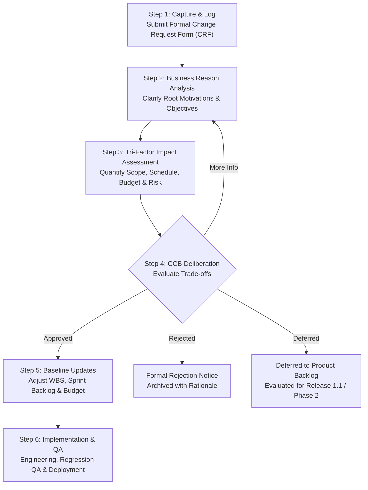
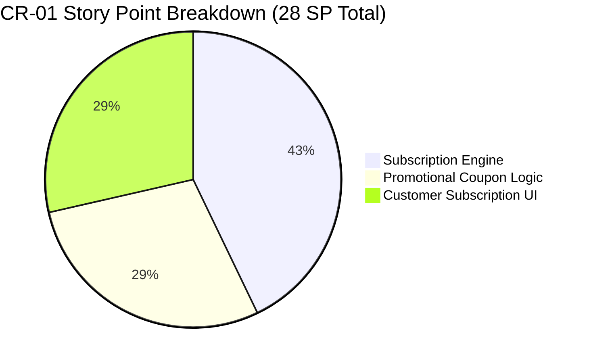
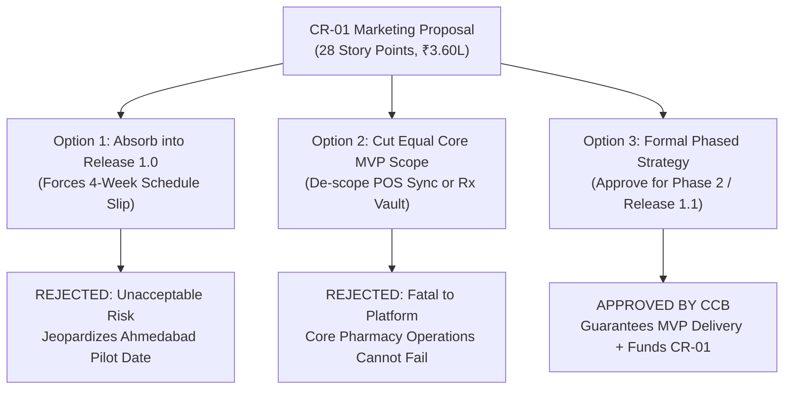
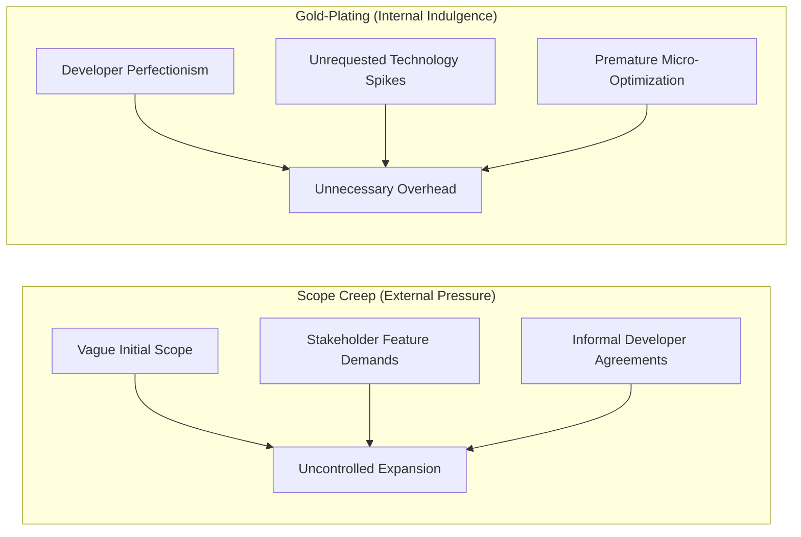

# Software Engineering & Project Management Documentation
## Document 06: Change Management Plan & Change Control Governance

---

### Document Control & Metadata
* **Project Name:** PharmaCart — Omni-Channel Retail Pharmacy Ordering & Inventory Platform
* **Document Identifier:** PC-CMP-DOC-006
* **Version:** 1.0 (Baseline Proposal - Pending Sign-Off)
* **Author / CCB Chair:** Ritesh Jadhav, Lead Project Manager & Systems Architect
* **Target Audience:** Project Steering Committee, Executive Leadership, Store General Managers, Engineering & QA Teams

---

## Table of Contents
1. [Executive Summary & Purpose](#1-executive-summary--purpose)
2. [Change Control Board (CCB) Charter](#2-change-control-board-ccb-charter)
3. [The 6-Step Formal Change Control Lifecycle](#3-the-6-step-formal-change-control-lifecycle)
4. [Change Request Template & Submission Artifacts](#4-change-request-template--submission-artifacts)
5. [In-Depth Case Study: Marketing Request (CR-01)](#5-in-depth-case-study-marketing-request-cr-01)
6. [Master Change Request Log (CRL)](#6-master-change-request-log-crl)
7. [Scope Creep & Gold-Plating Defense Strategy](#7-scope-creep--gold-plating-defense-strategy)
8. [Configuration Management & Traceability Integration](#8-configuration-management--traceability-integration)
9. [Formal CCB Sign-Off & Governance Endorsement](#9-formal-ccb-sign-off--governance-endorsement)

---

## 1. Executive Summary & Purpose

### 1.1 Purpose of the Change Management Plan
In a distributed retail healthcare software initiative spanning 14 physical pharmacies across Ahmedabad, project requirements cannot remain completely static. Market conditions, competitive forces, pharmacy council directives, and marketing initiatives will inevitably prompt stakeholders to request enhancements, architectural revisions, and operational deviations.

Uncontrolled requirement volatility—commonly referred to as **Scope Creep**—is the primary failure mode of software engineering projects. The purpose of this **Change Management Plan (CMP)** is to establish a rigorous, transparent, and defensible governance mechanism. It ensures that:
* Every requested change is captured, documented, and justified by business value.
* The multi-dimensional impact on **Scope**, **Schedule**, **Budget**, **System Quality**, and **Regulatory Compliance** is mathematically analyzed prior to execution.
* The baseline Core MVP (72 Story Points, 12 Weeks, ₹8.80 Lakh) remains protected against arbitrary expansion.
* Approved modifications are executed with zero disruption to the active critical path.

### 1.2 Boundary of Change Control
This protocol governs all modifications affecting:
1. **Requirements Baseline:** Functional and non-functional specifications defined in [01_SRS_Document.md](file:///Users/riteshjadhav/Desktop/ProjectManagment/01_SRS_Document/01_SRS_Document.md).
2. **Architectural Baseline:** Data models, interfaces, and state machines established in [02_UML_Package.md](file:///Users/riteshjadhav/Desktop/ProjectManagment/02_UML_Package/02_UML_Package.md).
3. **Project Schedule & Budget:** Sprint allocations, milestones, and cash outlays established in [03_Project_and_Budget_Plan.md](file:///Users/riteshjadhav/Desktop/ProjectManagment/03_Project_and_Budget_Plan/03_Project_and_Budget_Plan.md).
4. **Quality Gates & Release Baselines:** Acceptance criteria and test coverage defined in [04_Test_Plan_and_Evidence.md](file:///Users/riteshjadhav/Desktop/ProjectManagment/04_Test_Plan_and_Evidence/04_Test_Plan_and_Evidence.md).

---

## 2. Change Control Board (CCB) Charter

### 2.1 Governance Structure & Membership
The **Change Control Board (CCB)** is the formal steering entity authorized to evaluate, approve, defer, or reject all proposed modifications to project baselines.

| CCB Role | Designee / Title | Primary Responsibilities | Voting Authority |
| :--- | :--- | :--- | :---: |
| **CCB Chair & Project Manager** | **Ritesh Jadhav** | Convenes meetings, enforces CMP compliance, oversees impact analysis, and holds final execution authority. | **1 Vote (Veto & Casting)** |
| **Chief Pharmacist & Compliance** | Dr. A. K. Patel (VP Clinical) | Evaluates Schedule H/H1 legality, tele-pharmacy SLA impact, and GSP adherence. | **1 Vote (Veto on Compliance)** |
| **Lead Software Architect** | Technical Lead | Assesses architectural coupling, POS sync latency, scalability, and code maintainability. | **1 Vote** |
| **Director of Store Operations** | Retail Operations GM | Assesses counter staff friction, store hardware constraints, and Ahmedabad pilot readiness. | **1 Vote** |
| **VP of Marketing & Sales** | Commercial Lead | Advocates business ROI, customer acquisition drivers, and promotional campaign alignment. | **1 Vote** |
| **Lead QA & Reliability Engineer** | QA Test Lead | Quantifies regression testing effort, test suite expansion, and defect risk exposure. | Advisory (Non-Voting) |

### 2.2 Quorum & Decision Rules
* **Quorum:** A valid CCB meeting requires the presence of at least 4 voting members, including the CCB Chair and Chief Pharmacist.
* **Approval Threshold:** Formal approval requires a majority vote (>= 3 of 5 voting members) **and** zero regulatory vetoes from the Chief Pharmacist.
* **The Clinical Veto Rule:** If any change violates Gujarat State Pharmacy Council directives, Drugs and Cosmetics Act regulations, or patient safety mandates, the Chief Pharmacist holds absolute unilateral veto authority.
* **The Fiscal & Schedule Ceiling Rule:** If any change threatens to breach the hard project ceiling of **₹14.0 Lakh** or the **5-Month calendar deadline**, the CCB Chair must reject or defer the request to post-MVP operations unless additional capital and time are formally injected by the Executive Sponsor.

---

## 3. The 6-Step Formal Change Control Lifecycle

The PharmaCart project adheres to a disciplined 6-stage lifecycle for all change proposals.



### Step 1: Capture & Submission
* Any project stakeholder (Marketing, Store Managers, Clinical Staff, Engineering) may initiate a change by submitting a standardized **Change Request Form (CRF)**.
* Verbal, chat, or informal requests are strictly prohibited from engineering backlogs.
* Within 24 business hours of receipt, the CCB Chair assigns a tracking ID (`CR-XX`) and records it in the **Master Change Request Log (CRL)**.

### Step 2: Understand the Business Reason
* The CCB reviews the fundamental business drivers behind the request.
* Requests are categorized into one of five operational drivers:
  1. *Regulatory / Legal Compliance* (Mandatory).
  2. *Defect Mitigation / Operational Stability* (Urgent).
  3. *Competitive Advantage / Revenue Growth* (Commercial).
  4. *Customer Experience Enhancement* (Usability).
  5. *Internal Operational Efficiency* (Cost Reduction).
* If the underlying motivation lacks clear business metrics (e.g., projected customer retention, regulatory penalty avoidance), the request is returned for clarification.

### Step 3: Tri-Factor Impact Assessment
Before the CCB convenes, a joint technical-business task force performs an exhaustive multi-dimensional impact assessment:
1. **Scope Impact:** Precise Delta in Story Points (+/- SP), affected WBS elements, and modified architectural modules.
2. **Schedule Impact:** Additional working days required, impact on Early Finish (EF) / Late Finish (LF) of critical path tasks, and projected sprint shift.
3. **Cost Impact:** Development labor outlay (Hours * ₹1,500/hr or Sprint burn), infrastructure overhead, and third-party API licensing costs.
4. **Quality & Risk Impact:** Additional regression test cases needed, test environment dependencies, and risk exposure delta ($P \times I$).

### Step 4: CCB Deliberation & Disposition
The CCB meets on a scheduled bi-weekly cadence (or within 48 hours for Critical severity requests) to review the impact assessment. The board renders one of four binding verdicts:
* **Approved for Current Release:** The change is integrated into the active sprint plan, with compensatory scope de-prioritization if schedule slippage threatens milestones.
* **Deferred to Next Release (Phase 2):** The change is validated as valuable but scheduled for post-MVP execution (Release 1.1) to safeguard the 12-week Core MVP launch date.
* **Rejected:** The change contradicts architectural principles, incurs disproportionate risk, or provides insufficient business return on investment.
* **Request More Information (RMI):** The technical or commercial analysis requires further data before a determination can be made.

### Step 5: Update Baselines & Plans
Upon approval, the CCB Chair and Technical Leads execute formal configuration updates:
* **SRS Update:** New Functional Requirements (FRs) added; Requirement Traceability Matrix (RTM) updated.
* **Sprint Backlog Revision:** Approved user stories placed in designated sprint backlogs.
* **WBS & Gantt Revision:** Activity durations and precedence links re-calculated; baseline version incremented (e.g., Baseline v1.0 to Baseline v1.1).
* **Budget Tracking:** Allocated contingency funds deducted from the ₹5.20 Lakh reserve.

### Step 6: Implementation, QA Verification & Formal Closure
* Engineering builds the feature under an isolated Git feature branch (`feat/cr-xx-description`).
* The QA team executes targeted unit tests, integration suites, and complete regression tests per [04_Test_Plan_and_Evidence.md](file:///Users/riteshjadhav/Desktop/ProjectManagment/04_Test_Plan_and_Evidence/04_Test_Plan_and_Evidence.md).
* The CCB Chair verifies that acceptance criteria and NFR SLAs are verified in staging.
* The change is formally closed, deployed, and marked as `VERIFIED & CLOSED` in the CRL.

---

## 4. Change Request Template & Submission Artifacts

To maintain rigorous configuration control, all stakeholders must utilize the standardized PharmaCart Change Request Form.

| Field Identifier | Field Name | Description & Mandatory Input Guidelines |
| :--- | :--- | :--- |
| **CR-ID** | Change Request Identifier | Unique sequential tracking identifier (e.g., `CR-01`, `CR-02`). |
| **DATE-SUBMITTED** | Submission Date | Calendar date of formal logging (YYYY-MM-DD). |
| **INITIATOR** | Requesting Stakeholder | Name, departmental title, and contact details of the requester. |
| **TITLE** | Change Summary | Concise, descriptive title of the proposed capability. |
| **DESCRIPTION** | Detailed Specification | Exact description of current baseline behavior vs. proposed modification. |
| **BUSINESS JUSTIFICATION** | Business Driver & Value | Concrete revenue, compliance, customer retention, or operational rationale. |
| **SEVERITY / URGENCY** | Priority Classification | *Critical* (Breaks law/production), *High* (Major value), *Medium* (Standard), *Low* (Cosmetic). |
| **TARGET PHASE** | Desired Delivery Window | Core MVP (Release 1.0) vs. Phase 2 (Release 1.1). |

---

## 5. In-Depth Case Study: Marketing Request (CR-01)

### 5.1 The Scenario: Marketing's High-Pressure Demand
At the conclusion of Sprint 1, the Vice President of Marketing submitted a high-priority change proposal:
* **Feature Request:** Implement a **Chronic Medicine Auto-Refill Subscription Engine** and **Tiered Promotional Discount / Coupon System** immediately in Release 1.0.
* **Marketing Justification:** Competitors (Tata 1mg, Apollo 24/7) offer auto-refill subscriptions for diabetic and hypertensive patients. Marketing projected that launching without recurring subscriptions would sacrifice 35% of high-LTV (Lifetime Value) chronic care customer acquisition during the initial launch quarter.
* **Initial Pressure:** Marketing demanded that engineering absorb this request into the 12-week MVP timeline without shifting the launch date.

---

### 5.2 Step 1 & 2: Change Proposal Capture & Business Motivation

| Attribute | Specification Details |
| :--- | :--- |
| **Change ID** | **CR-01** |
| **Initiator** | VP of Marketing & Commercial Strategy |
| **Date Logged** | 2026-10-19 (End of Sprint 1) |
| **Title** | Chronic Medicine Recurring Auto-Refill Subscriptions & Dynamic Coupon Engine |
| **Business Objective** | Maximize customer retention for high-margin chronic ailments (Cardiology, Diabetology) across Ahmedabad. |
| **Target Audience** | ~4,200 recurring chronic medication buyers currently visiting the 14 physical stores. |

---

### 5.3 Step 3: Rigorous Tri-Factor Impact Assessment

The CCB technical task force, chaired by **Ritesh Jadhav**, conducted a 48-hour technical and operational evaluation.

#### A. Scope Impact (Work Packages & Complexity Analysis)
Implementing CR-01 requires three substantial new functional modules:
1. **Recurring Subscription Scheduler (Backend):** Cron-like scheduler to calculate re-order intervals (30, 60, 90 days), trigger pharmacist review 5 days before exhaustion, and handle tokenized recurring billing.
2. **Promotional Discount & Cart Rule Engine (FinTech):** Minimum order value validations, category restrictions (discounting Schedule H drugs is strictly regulated), usage limits per customer, and coupon abuse protection.
3. **Customer Subscription Management UI (Frontend):** Mobile web portal views to pause, modify delivery dates, alter dosages, and update stored payment methods.



* **Total Additional Effort:** **28 Story Points**.
* **Relative Scope Expansion:**
  ```text
  Baseline Core MVP Scope: 72 Story Points
  CR-01 Scope Addition:    28 Story Points
  Total Proposed Scope:   100 Story Points (+38.8% Increase)
  ```

#### B. Schedule Impact (Critical Path & Velocity Analysis)
PharmaCart's empirically proven development velocity is **14 Story Points per 2-week Sprint** (7 Story Points/week).
* **Additional Development Time:**
  ```text
  Additional Sprints = 28 Story Points / 14 Story Points per Sprint = 2.0 Full Sprints (4 Calendar Weeks)
  ```
* **Critical Path Collision:**
  * Baseline Core MVP completion: Week 12 (Month 3).
  * If absorbed into Release 1.0: Launch date slips from **Week 12 to Week 16** (Month 4).
  * Schedule buffer drops from 9.3 weeks down to only **5.3 weeks**.

#### C. Budget & Cost Impact (Labor & Reserves)
* **Development Labor Burn:** 2 additional sprints = 1 month of dedicated team burn = **₹2,40,000 / month * 1.0 Month = ₹2,40,000**.
* **Third-Party SaaS Overhead:** Recurring payment mandate tokenization (Razorpay Subscriptions API) and high-volume transactional WhatsApp alert packs = **₹40,000**.
* **Targeted QA & Security Auditing:** Penetration testing for coupon tampering and recurring billing logic = **₹80,000**.
* **Total Financial Cost of CR-01:** **₹3,60,000**.

#### D. Regulatory & Operational Risk Impact
* **Chief Pharmacist Assessment:** Under the Drugs and Cosmetics Rules, Schedule H prescription refills **cannot be automated unconditionally**. A licensed pharmacist must verify that the doctor's original prescription remains valid, that maximum refill counts have not been exceeded, and that the patient has not reported adverse drug reactions. Automating dispatch without human clinical sign-off would violate state pharmacy regulations.

---

### 5.4 Step 4: CCB Deliberation, Decision & Trade-Off Modeling

The CCB convened on 2026-10-21 to evaluate the three possible paths:



#### Detailed Trade-Off Matrix Evaluated by CCB:

| Evaluation Dimension | Option 1: Cram into Release 1.0 | Option 2: Swap Scope (1-for-1 Cut) | Option 3: Phased Release 1.1 (Selected) |
| :--- | :--- | :--- | :--- |
| **Release 1.0 Launch Date** | Slipped to Week 16 (4-Week Delay) | Week 12 (Preserved) | **Week 12 (100% Preserved)** |
| **Core Operational Integrity** | Strained; QA condensed by 50% | Catastrophic; requires cutting POS sync | **Flawless; 100% Core QA executed** |
| **Budget Position** | Consumes ₹3.6L; reserves drop to ₹1.6L | Neutral | **Funded from ₹5.20L reserve; leaves ₹1.60L** |
| **Pharmacy Council Compliance** | High legal liability (rushed refill logic)| Acceptable | **100% Compliant; includes human gate** |
| **Marketing Satisfaction** | Delayed total platform launch | Core customers alienated | **Gets fully robust engine in Month 4** |

#### The CCB Binding Ruling:
1. **Unanimous Disposition: APPROVED FOR PHASE 2 (RELEASE 1.1).**
2. **Defensible Rationale:** 
   * Release 1.0 (Core MVP) will launch on schedule at **Week 12** containing all 72 baseline story points (Prescription Desk, 14-Store POS Sync, 2-Unit Safety Buffer, In-Store Pickup).
   * Sprints 7 and 8 (Weeks 13–16) are formally commissioned as **Phase 2 (Release 1.1: Loyalty & Retention Expansion)**.
   * Development of CR-01 will commence immediately upon successful completion of the 3-store Ahmedabad pilot in Week 11.
   * The financial outlay of **₹3,60,000** is formally allocated from the **₹5,20,000 unallocated project cash reserve**, leaving an uncommitted liquid buffer of **₹1,60,000** for emergency hardware contingencies.
   * The feature architecture is updated to mandate an explicit **Pharmacist Clinical Re-authorization Checkbox** prior to every recurring monthly dispense, neutralizing regulatory liability.

---

### 5.5 Step 5: Baselines & Configuration Updates

Following CCB approval, the following formal document modifications were recorded:
* **WBS Update:** Created Work Package `WBS 6.0: Chronic Care & Commercial Engine` with sub-tasks 6.1 (Subscription Engine), 6.2 (Coupon Rule Matrix), and 6.3 (Customer Portal Controls).
* **RTM Update:** Linked CR-01 to Functional Requirements `FR-13: Chronic Refill Management` and `FR-14: Dynamic Promotional Engine`.
* **Budget Ledger Update:**
  ```text
  Total Available Capital:               ₹14,00,000
  Baseline Core MVP Expenditure:        - ₹8,80,000
  Unallocated Capital Prior to CR-01:    ₹5,20,000
  CR-01 Phase 2 Allocation:             - ₹3,60,000
  Remaining Liquidity Contingency:       ₹1,60,000
  ```

---

### 5.6 Step 6: Implementation, QA & Deployment Plan

The phased engineering schedule for CR-01 seamlessly bridges Release 1.0 stabilization and Release 1.1 go-live:

| Milestone / Deliverable | Target Timeline | Verification Criteria & QA Gate | Sign-Off Authority |
| :--- | :--- | :--- | :--- |
| **Architecture Specification** | Week 11 (During QA) | Architecture doc update; PCI-DSS token storage design review | Lead Architect |
| **Sprint 7 Engineering** | Weeks 13–14 | Scheduler daemon unit tests (>90% branch coverage) | Tech Lead |
| **Sprint 8 Engineering** | Weeks 15–16 | Razorpay webhook reconciliation, coupon abuse penetration tests | Lead QA Engineer |
| **Clinical Acceptance Gate** | Week 16 (End) | Council verification gate signed off by Chief Pharmacist | Dr. A. K. Patel |
| **Production Rollout (v1.1)**| Week 17 (Month 4) | Zero downtime deployment across all 14 Ahmedabad store portals | **Ritesh Jadhav** |

---

## 6. Master Change Request Log (CRL)

The following log tracks all formal change requests submitted throughout the PharmaCart development lifecycle.

| CR-ID | Date Logged | Request Title & Initiator | Scope Delta | Cost Impact | Schedule Impact | Status / Disposition | CCB Decision Date |
| :---: | :---: | :--- | :---: | :---: | :---: | :---: | :---: |
| **CR-01** | 2026-10-19 | Chronic Medicine Refill Subscriptions & Dynamic Coupon Engine<br>*(VP Marketing)* | +28 SP | +₹3,60,000 | +4 Weeks (Post-MVP) | **Approved for Phase 2 (Release 1.1)** | 2026-10-21 |
| **CR-02** | 2026-11-04 | Ayushman Bharat Digital Mission (ABDM / ABHA ID) Integration<br>*(Compliance Dept)* | +14 SP | +₹1,80,000 | +2 Weeks | **Under Technical Evaluation** | Pending Sandbox API Docs |
| **CR-03** | 2026-11-12 | Real-Time Delivery Rider GPS Tracking & Route Optimization<br>*(Logistics Partner)* | +35 SP | +₹4,50,000 | +5 Weeks | **REJECTED (Out of Scope)** | 2026-11-14 |
| **CR-04** | 2026-11-20 | Regional Language UI (Gujarati & Hindi Multilingual Localization)<br>*(Ahmedabad Store Mgrs)* | +10 SP | +₹1,20,000 | +1.5 Weeks | **Deferred to Q2 FY27 Backlog** | 2026-11-22 |

### Detailed Disposition Rationale for Logged Requests:
1. **CR-02 (ABDM / ABHA Health ID):** Evaluating whether integrating the Indian government's digital health identity system should be deployed during Phase 2. Decision deferred pending National Health Authority (NHA) milestone 2 sandbox stability.
2. **CR-03 (Delivery Rider GPS Tracking):** Unanimously **REJECTED**. PharmaCart's foundational value proposition is localized store pickup and third-party logistics dispatch. Building an in-house Uber-style rider fleet routing engine is classic gold-plating that directly violates our retail pharmacy mission.
3. **CR-04 (Multilingual Localization):** Validated as beneficial for retail counter customers in Gujarat, but existing mobile web users predominantly utilize English medicine names. Deferred to FY27 Q2 enhancement cycle.

---

## 7. Scope Creep & Gold-Plating Defense Strategy

### 7.1 Scope Creep vs. Gold-Plating: Definitions & Root Causes



* **Scope Creep (External):** The uncontrolled, unapproved addition of features by stakeholders without corresponding adjustments to budget, time, or resources.
* **Gold-Plating (Internal):** The unauthorized practice of engineers adding extra complexity, unrequested utility libraries, or over-engineered abstractions beyond what the customer specified, under the guise of "doing a thorough job."

---

### 7.2 The 5 Core Defense Policies for PharmaCart

To ensure zero scope creep and zero gold-plating during the 12-week construction window, the following governance policies are strictly enforced:

#### Policy 1: Zero Informal Channels (The "No Hallway Agreement" Rule)
* Engineers are strictly forbidden from altering API contracts, database schemas, or UI elements based on verbal conversations, WhatsApp messages, or store manager requests.
* Any engineer who commits code addressing an unlogged requirement will have their pull request immediately rejected by the Tech Lead.

#### Policy 2: The "Trade-In" Requirement for Scope Additions
* If business leadership insists that an emergent feature must launch in Release 1.0, an **equivalent volume of story points must be explicitly removed** from the active sprint backlog:
  ```text
  Scope In = Scope Out (Delta SP = 0)
  ```
* For example, if a new 8-point store reporting widget is approved for Release 1.0, an existing 8-point feature (such as customer order history export or loyalty points display) must be decommissioned from Release 1.0.

#### Policy 3: Strict Definition of Done (DoD) Enforcement
Every user story in the PharmaCart backlog has explicit, legally binding acceptance criteria. 
* A story is considered "Done" when its acceptance criteria pass—nothing more, nothing less.
* Pull requests that add unrequested features or unneeded third-party libraries will fail the Architecture Quality Gate.

#### Policy 4: The 15% Architectural Simplicity Rule (YAGNI & KISS)
* Engineers must adhere strictly to **YAGNI (You Aren't Gonna Need It)**.
* Building complex generic plugin architectures, multi-tenant databases (when only 14 retail stores exist in a single tenant), or Kafka streaming clusters when a lightweight Redis pub/sub queue meets NFR SLAs is treated as an engineering defect.

#### Policy 5: Agile Backlog Pruning at Sprint Boundaries
* At the beginning of each 2-week sprint planning meeting, the Project Manager and CCB Chair reviews all logged user stories against the project's primary KPI: **Launching 14 connected stores with reliable 30-second POS sync by Week 12.** Any task not contributing to this goal is immediately pruned.

---

## 8. Configuration Management & Traceability Integration

### 8.1 Baseline Management & Version Control Scheme
All project deliverables are maintained under formal semantic version control to ensure complete traceability.

| Deliverable Type | Primary Artifact File | Baseline Version (Approved) | Next Revision Trigger |
| :--- | :--- | :---: | :--- |
| **Requirements** | [01_SRS_Document.md](file:///Users/riteshjadhav/Desktop/ProjectManagment/01_SRS_Document/01_SRS_Document.md) | v1.0 | CCB-approved functional modifications |
| **System Architecture**| [02_UML_Package.md](file:///Users/riteshjadhav/Desktop/ProjectManagment/02_UML_Package/02_UML_Package.md) | v1.0 | Data schema or interface modifications |
| **Project Plan & CPM** | [03_Project_and_Budget_Plan.md](file:///Users/riteshjadhav/Desktop/ProjectManagment/03_Project_and_Budget_Plan/03_Project_and_Budget_Plan.md) | v1.0 | Sprint velocity recalibration or scope changes |
| **QA Test Plan** | [04_Test_Plan_and_Evidence.md](file:///Users/riteshjadhav/Desktop/ProjectManagment/04_Test_Plan_and_Evidence/04_Test_Plan_and_Evidence.md) | v1.0 | Test case expansion for new releases |
| **Risk Register** | [05_Risk_Register_and_Closure_Note.md](file:///Users/riteshjadhav/Desktop/ProjectManagment/05_Risk_Register_and_Closure_Note/05_Risk_Register_and_Closure_Note.md) | v1.0 | Monthly risk re-scoring or incident emergence |
| **Change Control** | [06_Change_Management.md](file:///Users/riteshjadhav/Desktop/ProjectManagment/06_Change_Management/06_Change_Management.md) | v1.0 | CCB charter or policy updates |

### 8.2 End-to-End Change Traceability Matrix
When a change request transitions to `APPROVED`, it is assigned end-to-end traceability across the entire engineering artifact suite:

```text
CR-01 (Marketing Request)
  │
  ├──► SRS Requirement:       FR-13 (Chronic Subscriptions) & FR-14 (Coupons)
  ├──► Architecture Module:   SubscriptionSchedulerDaemon & CouponValidatorService
  ├──► Test Plan Test Cases:   TC-SUB-01 through TC-SUB-12 (Payment Tokenization & Cadence)
  ├──► Risk Register Entry:   RSK-05 (Automated Schedule H Refill Compliance Hazard)
  └──► Project Estimation:    Phase 2 (Sprints 7 & 8, 28 Story Points, ₹3.60L Budget)
```

---

## 9. Formal CCB Sign-Off & Governance Endorsement

The following voting members of the **PharmaCart Change Control Board** are designated to review, ratify, and endorse this Change Management Plan. Formal baseline endorsement remains pending final convening and sign-off.

| Role / Title | Board Member Name | Signature & Ratification Date | Approval Status |
| :--- | :--- | :---: | :---: |
| **CCB Chair & Lead Project Manager** | **Ritesh Jadhav** | Pending | **Pending** |
| **Chief Pharmacist & Compliance VP** | Dr. A. K. Patel | Pending | **Pending** |
| **Lead Software Architect** | Technical Lead | Pending | **Pending** |
| **Director of Store Operations** | Retail Operations GM | Pending | **Pending** |
| **VP of Commercial Strategy & Marketing**| Commercial Lead | Pending | **Pending** |

---
*End of Document 06: Change Management Plan & Change Control Governance*
