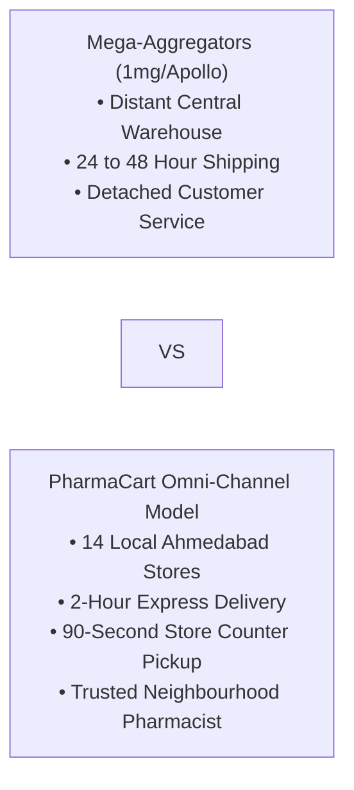
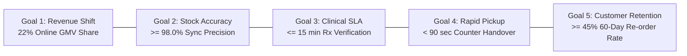
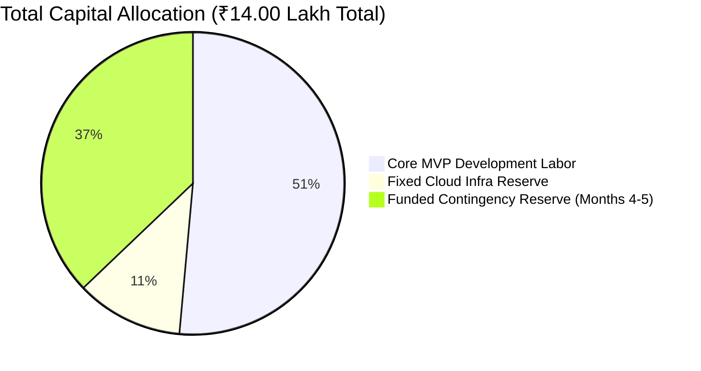

# Software Engineering & Project Management Documentation
## Document 07: Business Requirements Document (BRD)

---

### Document Control & Metadata
* **Project Name:** PharmaCart — Omni-Channel Retail Pharmacy Ordering & Inventory Platform
* **Document Identifier:** PC-BRD-DOC-007
* **Version:** 1.0 (Baseline Proposal - Pending Sign-Off)
* **Author / Principal Business Analyst:** Ritesh Jadhav, Lead Systems Analyst & Solution Architect
* **Project Sponsor:** Managing Director & Executive Board, PharmaCart Retail Pharmacy Chain
* **Target Audience:** Executive Steering Committee, Store General Managers, Commercial & Clinical Stakeholders, Architecture & Engineering Teams

---

## Table of Contents
1. [Executive Summary & Business Context](#1-executive-summary--business-context)
2. [Problem Statement & Business Opportunity](#2-problem-statement--business-opportunity)
3. [Current State (As-Is) vs. Future State (To-Be) Analysis](#3-current-state-as-is-vs-future-state-to-be-analysis)
4. [Business Goals, Objectives & Strategic KPIs](#4-business-goals-objectives--strategic-kpis)
5. [Stakeholder Analysis & Detailed Personas](#5-stakeholder-analysis--detailed-personas)
6. [High-Level Business Requirements (BRs)](#6-high-level-business-requirements-brs)
7. [Financial Feasibility, ROI & Business Case](#7-financial-feasibility-roi--business-case)
8. [Business Constraints, Assumptions & Regulatory Boundaries](#8-business-constraints-assumptions--regulatory-boundaries)
9. [Operational Acceptance & Sign-Off](#9-operational-acceptance--sign-off)

---

## 1. Executive Summary & Business Context

### 1.1 The Retail Pharmacy Landscape in Ahmedabad
PharmaCart operates a successful, established network of **14 physical retail pharmacies** strategically distributed across the metropolitan region of Ahmedabad, Gujarat (covering high-density urban corridors including Navrangpura, Satellite, Vastrapur, Maninagar, Paldi, Bopal, Bodakdev, and Naranpura).

For over two decades, the pharmacy chain has built enduring customer loyalty based on neighbourhood trust, personal relationships between community pharmacists and families, and immediate availability of critical acute and chronic therapeutic medications.

However, rapid digital transformation in urban India has disrupted traditional pharmacy retail:
* Mega-e-pharmacy aggregators (e.g., Tata 1mg, Apollo 24/7, PharmEasy, Netmeds) have aggressively penetrated the Ahmedabad market with mobile app ordering and aggressive discounts.
* **The Neighbourhood Pharmacy Advantage:** While central-warehouse aggregators promise home delivery, their typical delivery window is **24 to 48 hours** from distant regional distribution centers. In contrast, PharmaCart possesses **14 local fulfillment nodes** situated within 3 to 5 kilometers of 85% of Ahmedabad's residential population.
* By digitally uniting these 14 physical storefronts into a synchronized, real-time omni-channel platform, PharmaCart can provide **under-2-hour doorstep delivery** and **90-second express in-store counter pickup**, combining digital convenience with physical neighbourhood immediacy.



### 1.2 Purpose of this Document
This **Business Requirements Document (BRD)** establishes the definitive commercial vision, strategic objectives, business requirements, and economic justification for the PharmaCart platform. It bridges commercial strategy and technical execution, serving as the direct baseline for the technical [01_SRS_Document.md](file:///Users/riteshjadhav/Desktop/ProjectManagment/01_SRS_Document/01_SRS_Document.md) and architectural specifications in [02_UML_Package.md](file:///Users/riteshjadhav/Desktop/ProjectManagment/02_UML_Package/02_UML_Package.md).

---

## 2. Problem Statement & Business Opportunity

### 2.1 The Core Business Problem
Despite generating healthy counter footfall, PharmaCart is experiencing an accelerating loss of market share, customer attrition, and operational friction due to four systemic operational bottlenecks:

| Business Bottleneck | Commercial Impact | Quantitative Evidence / Metric |
| :--- | :--- | :--- |
| **1. Digital Footfall Leakage** | Young, working-age urban consumers increasingly avoid physical queues and order recurring chronic medications via mobile apps. | Estimated **18% year-on-year drop** in chronic refill footfall across premier Ahmedabad branches (Satellite & Navrangpura). |
| **2. Inventory Blind Spots & Phantom Stockouts** | The 14 stores operate isolated on-premise desktop billing machines. Store A has no visibility into Store B's stock, causing lost sales when a customer is turned away despite stock existing 2 km away. | **38% of walk-in stockouts** could have been fulfilled by an adjacent sister store within a 15-minute radius. |
| **3. Peak-Hour Counter Congestion** | Validating handwritten doctor prescriptions at the retail counter during peak evening hours (6:00 PM – 9:00 PM) creates severe customer wait times and counter congestion. | Average counter wait time during peak hours exceeds **14.5 minutes per prescription order**. |
| **4. Zero Cross-Store Retention** | Customer purchases are tracked only as local receipts on isolated POS machines, preventing centralized customer loyalty, auto-refill alerts, or unified service across Ahmedabad. | Customer lifetime value (LTV) is capped; **zero visibility** into chain-wide purchase frequency. |

---

### 2.2 The Business Opportunity
By developing an integrated, omni-channel commerce and clinical verification platform, PharmaCart can capture a commanding market position:
1. **Unlocking Express Hyperlocal Fulfillment:** Leveraging the 14-store footprint to offer guaranteed 2-hour doorstep delivery or 90-second express store counter pickup (Click-and-Collect).
2. **Eliminating Stockout Disputes via Safety Stock Logic:** Bridging physical and digital retail by introducing a **2-unit safety stock buffer** (`Effective Available = Max(0, Physical Count - 2)`) and **30-minute temporary soft holds** during customer checkout.
3. **Centralizing Tele-Pharmacy Verification:** Moving prescription review from congested physical store counters to a centralized, cloud-based tele-pharmacy desk, achieving a **<= 15 minute clinical review SLA**.
4. **Capturing High-LTV Chronic Care:** Establishing customer subscription auto-refills and targeted retail loyalty across diabetes, hypertension, and cardiac patient cohorts.

---

## 3. Current State (As-Is) vs. Future State (To-Be) Analysis

### 3.1 Comparative Process Flow

```mermaid
flowchart TD
    subgraph AsIs["Current State (As-Is): Fragmented Manual Retail"]
        A1["Customer travels to store"] --> A2["Stands in counter queue (10-15 mins)"]
        A2 --> A3["Pharmacist manually reviews paper Rx"]
        A3 --> A4{"Is Medicine in Stock?"}
        A4 -- No --> A5["Sale Lost: Customer leaves dissatisfied"]
        A4 -- Yes --> A6["Manual POS cash billing & handover"]
    end

    subgraph ToBe["Future State (To-Be): PharmaCart Omni-Channel"]
        B1["Customer orders via Mobile Web Catalog"] --> B2["Prescription uploaded to Secure Cloud Vault"]
        B2 --> B3["Central Tele-Pharmacist reviews (<= 15 min SLA)"]
        B3 --> B4["Multi-Store Router checks 14 POS daemons with 2-unit buffer"]
        B4 --> B5["Soft Hold placed on nearest store stock (30 min)"]
        B5 --> B6["Digital Payment captured via Razorpay"]
        B6 --> B7["Customer picks up via 6-digit OTP in 90 secs OR 2-hr delivery"]
    end
```



### 3.2 Operational Capability Delta Matrix

| Operational Capability | Current State (As-Is) | Future State (To-Be - PharmaCart Platform) | Strategic Advantage |
| :--- | :--- | :--- | :--- |
| **Customer Ordering Channels** | Physical counter walk-in only; occasional informal WhatsApp phone orders. | Progressive Web App (PWA), Mobile Web Catalog, and In-Store Express Kiosk. | 24/7 digital order intake across Ahmedabad. |
| **Prescription Review** | Dispersed, manual counter review by local store clerk under rush conditions. | Centralized Tele-Pharmacy Review Desk with dual-pane image viewer and audit logging. | Full compliance with GSPC regulations; error rate reduced by >90%. |
| **Inventory Visibility** | Disconnected local Windows POS databases (MS SQL, flat files); updated at day-end. | Real-time POS daemon syncing local deltas to cloud aggregator every **<= 30 seconds**. | Single unified chain inventory pool visible to all customers. |
| **Stockout Prevention** | None; physical counter customers frequently take the last box before online fulfillment. | Algorithmic **2-Unit Safety Stock Buffer** + **30-Minute Soft Hold** on checkout initiation. | Eliminates walk-in vs. online inventory collisions entirely. |
| **Order Routing** | Manual guesswork; phone calls between store managers to locate missing drugs. | Automated Proximity Routing Engine allocating orders to the nearest store with confirmed stock. | Minimizes delivery transit time and optimizes store picking workloads. |
| **Fulfillment Options** | Counter purchase only. | 1. Express Click-and-Collect (OTP Verification).<br>2. Hyperlocal 2-Hour Delivery. | Omni-channel flexibility tailored to patient urgency. |
| **Customer Data & Retention** | Isolated paper slips; zero unified transaction history. | Centralized cloud customer profile with prescription history and repeat re-order triggers. | Foundation for Phase 2 chronic medicine subscriptions (CR-01). |

---

## 4. Business Goals, Objectives & Strategic KPIs

The PharmaCart leadership committee has established five quantitative business goals to evaluate project success over the initial 6 months post-rollout:



### 4.1 Key Performance Indicators (KPIs)

| Business Goal | Measurable KPI | Baseline (Current) | 3-Month Target (Post-Launch) | 6-Month Steady State |
| :--- | :--- | :---: | :---: | :---: |
| **1. Digital Channel Adoption** | Online GMV as % of Total Chain Turnover | 0.0% | 12.0% | **22.0%** |
| **2. Inventory Synchronization** | Chain-wide stock accuracy rate (Physical vs. Digital) | ~72.0% (Estimated) | >= 95.0% | **>= 98.0%** |
| **3. Clinical Verification Turnaround** | Tele-pharmacy prescription review SLA | 25 to 45 Mins | <= 20 Mins | **<= 15 Mins** |
| **4. Click-and-Collect Express SLA** | Store counter pickup handover time (OTP verification) | 8 to 15 Mins | < 3 Mins | **< 90 Seconds** |
| **5. Repeat Customer Retention** | Chronic prescription 60-day repeat purchase rate | ~18.0% | 30.0% | **>= 45.0%** |
| **6. Inventory Discrepancy Rate** | Orders rejected due to counter stockout collision | > 14.0% | < 3.0% | **< 1.0%** |

---

## 5. Stakeholder Analysis & Detailed Personas

### 5.1 Primary Stakeholder Matrix

| Stakeholder Group | Primary Business Interests | Critical Concerns / Resistance Factors | Success Measure |
| :--- | :--- | :--- | :--- |
| **Executive Leadership (Managing Director & Owner)** | Revenue growth, brand defense against 1mg/Apollo, ROI realization, cash runway conservation. | Exceeding the ₹14.0L budget cap; project timeline slipping beyond 5 months. | Delivery of Core MVP within ₹8.80L / 12 Weeks; break-even within 4 months. |
| **Chief Pharmacist & Clinical Team** | Legal compliance with Drugs and Cosmetics Act (Schedule H/H1), patient safety, clear audit trails. | Non-pharmacist clerks issuing medicines; regulatory penalties or license suspension. | 100% human pharmacist review gate; immutable audit logging for 3 years. |
| **Retail Store Managers (14 Ahmedabad Outlets)** | Meeting store sales targets, ease of counter operations, zero counter chaos during evening rush. | Additional data entry burdens; software crashes freezing local counter billing. | Lightweight picking UI; local POS operations completely unblocked by network outages. |
| **Online Retail Customers** | Fast access to genuine medicines, quick prescription approval, express store pickup. | Clunky prescription upload; arriving at store only to find the medicine out of stock. | Intuitive mobile web checkout; guaranteed stock hold upon order confirmation. |

---

### 5.2 Key User Personas

#### Persona 1: The Chronic Patient Caregiver
* **Name:** Ramesh Bhai Patel (Age 58, Vastrapur, Ahmedabad)
* **Demographics:** Retired civil engineer caring for elderly mother with Type-2 diabetes and hypertension.
* **Pain Point:** Visits the Vastrapur outlet twice a month. Often waits 15 minutes in line only to discover that the specific brand of insulin cartridge is out of stock, forcing him to drive to Navrangpura.
* **Needs from PharmaCart:** A simple mobile web interface to upload his mother's prescription, view guaranteed real-time stock availability, reserve medicines with a 30-minute hold, and collect the pre-packed bag from the counter in under 2 minutes.

#### Persona 2: The Physical Store Pharmacist
* **Name:** Sandeep Joshi (Age 32, Registered Pharmacist, Satellite Branch)
* **Demographics:** B.Pharm graduate managing physical billing and customer consultation at a high-volume outlet.
* **Pain Point:** During peak evening rush, walk-in customers demand fast billing while online order dispatches require phone coordination. He fears stock being taken by online buyers before counter buyers pay.
* **Needs from PharmaCart:** A background POS daemon that automatically preserves a **2-unit safety stock buffer** for his walk-in customers, coupled with a simple, touch-screen pickup counter terminal that releases pre-bagged orders upon typing a 6-digit OTP.

#### Persona 3: The Central Tele-Pharmacist Reviewer
* **Name:** Dr. A. K. Patel (VP Clinical & Chief Pharmacist)
* **Demographics:** Senior licensed pharmacist overseeing compliance across all 14 stores.
* **Pain Point:** Reviewing illegible prescription photos on smartphones is error-prone and legally precarious under Gujarat State Pharmacy Council mandates.
* **Needs from PharmaCart:** A dual-pane clinical verification portal displaying high-resolution prescription images on the left and extracted medicine search/dosage pickers on the right, enforcing digital signing and license logging before orders are routed.

---

## 6. High-Level Business Requirements (BRs)

The PharmaCart platform must deliver the following core business capabilities:

| BR Code | Requirement Title | Business Description & Operational Value | Priority (MoSCoW) |
| :---: | :--- | :--- | :---: |
| **BR-01** | **Digital Medicine Catalog & Search** | Customers must be able to search all OTC and prescription medicines, view accurate generic compositions, pricing, and pack sizes without mandatory registration. | **Must Have** |
| **BR-02** | **Compliant Prescription Digital Upload** | Customers must be able to upload valid prescription images (PDF, JPG, PNG up to 10MB) stored in an AES-256 encrypted vault, triggering tele-pharmacy verification. | **Must Have** |
| **BR-03** | **Central Tele-Pharmacy Clinical Review** | A centralized queue for licensed pharmacists to inspect prescriptions, approve/reject items, annotate partial fulfills, and digitally sign orders within a 15-minute SLA. | **Must Have** |
| **BR-04** | **14-Store Real-Time POS Sync** | A lightweight local sync daemon operating on store Windows POS systems to transmit stock additions and counter sales to the cloud within 30 seconds. | **Must Have** |
| **BR-05** | **Anti-Mismatch Stock Buffer Engine** | Platform must deduct a 2-unit safety buffer from physical stock before displaying online availability, and place a 30-minute soft reservation hold on checkout. | **Must Have** |
| **BR-06** | **Proximity-Based Order Routing** | Automatically assign orders to the nearest store possessing verified available inventory, with sister-store failover if primary stock is exhausted. | **Must Have** |
| **BR-07** | **In-Store Express Pickup & OTP Flow** | Store counter pickup workflow enabling customers to retrieve packed orders in under 90 seconds by verifying a cryptographic 6-digit SMS OTP. | **Must Have** |
| **BR-08** | **Digital Payment Gateway Integration** | Support UPI (Google Pay, PhonePe, Paytm), Credit/Debit Cards, NetBanking via Razorpay with automated webhook reconciliation and instant failure refunds. | **Must Have** |
| **BR-09** | **Regulatory Compliance & Audit Logging** | Immutable, append-only audit trail logging pharmacist registration numbers, timestamps, prescription hashes, and order states, archived for 3 years. | **Must Have** |
| **BR-10** | **Post-Launch Auto-Refill Subscriptions** | Recurring scheduled refills for chronic care patients with mandatory pharmacist re-authorization before every monthly dispatch (Phase 2 / CR-01). | **Should Have** |

---

## 7. Financial Feasibility, ROI & Business Case

### 7.1 Capital Allocation & Investment Model
The PharmaCart initiative operates under a hard capital ceiling of **₹14.00 Lakh** allocated by the chain's executive board.



* **Core MVP Execution Cost (Month 1 to 3 / Sprints 1 to 6):**
  * Software Development Labor: 3 Months * ₹2,40,000 / month = **₹7,20,000**
  * Infrastructure, Security, AWS Hosting & Payment Gateway Setup: **₹1,60,000**
  * **Total Core MVP Investment (Release 1.0):** **₹8,80,000**
* **Preserved Cash Contingency Reserve:**
  ```text
  Contingency Reserve = Total Capital (₹14,00,000) - MVP Cost (₹8,80,000) = ₹5,20,000
  ```
  This ₹5.20 Lakh reserve provides **2.16 months of fully funded operating runway** (Months 4 and 5) to absorb pilot hardware upgrades, pharmacist training, and the Phase 2 Chronic Care Subscription engine (CR-01).

---

### 7.2 Projected Revenue & Break-Even Modeling

#### Unit Economics & Order Volume Projections across 14 Stores:
* **Average Daily Online Orders per Store (Month 3 to 6):** 15 orders/day/store
* **Total Daily Online Orders across 14 Stores:** 14 * 15 = **210 orders/day**
* **Average Order Value (AOV):** **₹650** (Weighted mix of acute and chronic basket sizes)
* **Daily Gross Merchandise Value (GMV):** 210 * ₹650 = **₹1,36,500 / day**
* **Monthly Online Gross Turnover (30 Days):** **₹40,95,000 / month (~₹41.0 Lakh)**
* **Average Pharmacy Retail Gross Margin:** **18.0%**
* **Monthly Gross Profit Generated by Online Channel:**
  ```text
  Monthly Gross Profit = ₹40,95,000 * 18.0% = ₹7,37,100 / month
  ```
* **Net Contribution Margin:** Deducting cloud hosting (₹25,000/mo), payment gateway fees (1.8% = ₹73,710/mo), and local delivery packaging (₹30/order = ₹1,89,000/mo):
  ```text
  Net Operating Monthly Profit = ₹7,37,100 - (₹25,000 + ₹73,710 + ₹1,89,000) = ₹4,49,390 / month
  ```

#### Break-Even Payback Period:
```text
Payback Period = Core MVP Investment (₹8,80,000) / Net Monthly Profit (₹4,49,390) = 1.95 Months of Full Operation
```
Even under conservative sensitivity modeling where initial online adoption reaches only 50% of targets (105 orders/day), net monthly profit exceeds **₹2,24,000/month**, achieving full capital payback within **3.9 months** of chain-wide rollout.

---

## 8. Business Constraints, Assumptions & Regulatory Boundaries

### 8.1 Regulatory & Legal Boundaries (Republic of India)
* **The Drugs and Cosmetics Act, 1940 & Rules, 1945:**
  * Schedule H and Schedule H1 drugs (e.g., antibiotics, psychotropics) **strictly require a valid doctor's prescription**. Online dispensing without human pharmacist review is a non-bailable offense.
  * Prescriptions must bear the registered medical practitioner's council number, patient name, date, and doctor's signature.
* **Gujarat State Pharmacy Council (GSPC) Directives:**
  * A registered pharmacist with an active council license must supervise dispensing at every physical node. Centralized review does not waive the physical store pharmacist's final verification responsibility.
* **Digital Personal Data Protection (DPDP) Act, 2023 & IT Act, 2000:**
  * Patient medical records and prescriptions constitute Sensitive Personal Data (SPD) and must be stored within Indian geographic territory under AES-256 encryption.

### 8.2 Operational & Technical Assumptions
1. **Store POS Hardware Heterogeneity:** The 14 stores operate diverse billing software (primarily Windows-based desktop terminals). The sync agent must be a non-invasive, lightweight background service requiring zero modifications to existing billing databases.
2. **Broadband Network Availability:** While all 14 stores have broadband, occasional localized disconnections occur. The store POS must function autonomously offline without halting physical counter billing.
3. **Delivery Radius:** Express 2-hour doorstep deliveries are restricted to a **5 km radius** around each of the 14 outlets, covering the greater Ahmedabad municipal boundaries.

---

## 9. Operational Acceptance & Sign-Off

The following commercial, operational, and clinical executives are designated to review, endorse, and accept this Business Requirements Document. Formal operational baseline endorsement remains pending final convening and sign-off.

| Executive Role | Stakeholder Name | Signature & Endorsement Date | Approval Status |
| :--- | :--- | :---: | :---: |
| **Principal Business Analyst & Architect** | **Ritesh Jadhav** | Pending | **Pending** |
| **Managing Director & Chain Owner** | Executive Sponsor | Pending | **Pending** |
| **Chief Pharmacist & Compliance VP** | Dr. A. K. Patel | Pending | **Pending** |
| **VP of Retail Store Operations** | Retail Operations GM | Pending | **Pending** |
| **VP of Commercial Strategy & Marketing**| Commercial Lead | Pending | **Pending** |

---
*End of Document 07: Business Requirements Document (BRD)*
