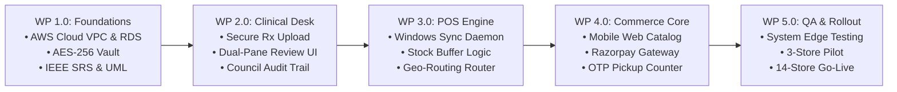
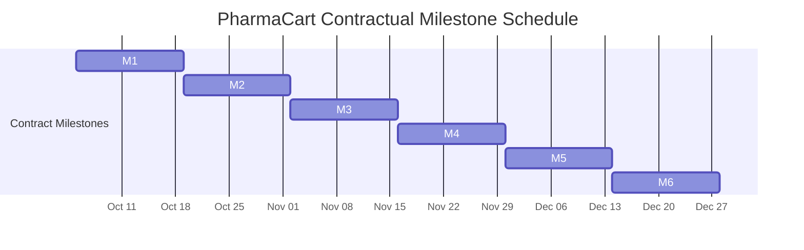

# Software Engineering & Project Management Documentation
## Document 08: Statement of Work (SOW)

---

### Contractual Document Control & Metadata
* **Project Name:** PharmaCart — Omni-Channel Retail Pharmacy Ordering & Inventory Platform
* **Document Identifier:** PC-SOW-DOC-008
* **Version:** 1.0 (Contractual Proposal - Pending Execution)
* **Effective Date:** October 5, 2026
* **Engagement Lead / Solution Architect:** Ritesh Jadhav, Lead Project Manager & Systems Architect
* **Client / Project Sponsor:** Managing Director & Executive Board, PharmaCart Retail Pharmacy Chain
* **Jurisdiction:** Ahmedabad, Gujarat, Republic of India

---

## Table of Contents
1. [Contractual Preamble & Scope of Agreement](#1-contractual-preamble--scope-of-agreement)
2. [Detailed Scope of Work & Deliverables Breakdown](#2-detailed-scope-of-work--deliverables-breakdown)
3. [Period of Performance & Milestone Schedule](#3-period-of-performance--milestone-schedule)
4. [Financial Terms, Pricing Model & Milestone Billing Schedule](#4-financial-terms-pricing-model--milestone-billing-schedule)
5. [Roles, Responsibilities & RACI Governance Matrix](#5-roles-responsibilities--raci-governance-matrix)
6. [Acceptance Criteria, Quality Gates & Sign-Off Protocol](#6-acceptance-criteria-quality-gates--sign-off-protocol)
7. [Change Management, Scope Creep & Governance Alignment](#7-change-management-scope-creep--governance-alignment)
8. [Intellectual Property, Data Security & Warranty Obligations](#8-intellectual-property-data-security--warranty-obligations)
9. [Formal Contractual Execution & Sign-Off](#9-formal-contractual-execution--sign-off)

---

## 1. Contractual Preamble & Scope of Agreement

### 1.1 Parties to the Agreement
This **Statement of Work ("SOW")** is entered into as of **October 5, 2026**, by and between:
* **The Client:** PharmaCart Retail Pharmacy Chain (Operating 14 licensed retail pharmacy outlets across Ahmedabad, Gujarat), represented by its Managing Director and Executive Board.
* **The Solution Delivery Partner / Engagement Lead:** **Ritesh Jadhav**, acting as Lead Systems Analyst, Software Architect, and Project Manager, leading the dedicated engineering and QA task force.

### 1.2 Purpose of Agreement
The purpose of this SOW is to define the technical, commercial, legal, and operational terms governing the design, construction, testing, integration, and chain-wide deployment of the **PharmaCart Omni-Channel Pharmacy Ordering & Inventory Synchronization Platform**. 

This contract binds both parties to the delivery of the agreed **Core MVP (72 Story Points)** within a fixed calendar window of **12 Weeks (3 Months)** and a total financial ceiling of **₹14,00,000 (Fourteen Lakh Indian Rupees)**.

---

## 2. Detailed Scope of Work & Deliverables Breakdown

### 2.1 In-Scope Deliverables (Core MVP — Release 1.0)
The delivery team led by **Ritesh Jadhav** shall engineer and deliver five integrated work packages comprising 72 story points:

| Work Package | Deliverable Name | Concrete Specifications & Technical Scope | Story Points |
| :---: | :--- | :--- | :---: |
| **WP 1.0** | **Project Inception & Cloud Foundation** | Multi-AZ AWS architecture setup (VPC, RDS PostgreSQL, S3 with AES-256 server-side encryption, Redis cache), finalized [01_SRS_Document.md](file:///Users/riteshjadhav/Desktop/ProjectManagment/01_SRS_Document/01_SRS_Document.md) and [02_UML_Package.md](file:///Users/riteshjadhav/Desktop/ProjectManagment/02_UML_Package/02_UML_Package.md). | **14 SP** |
| **WP 2.0** | **Prescription & Clinical Verification Desk** | High-performance prescription upload service (PDF, PNG, JPG), tele-pharmacy verification portal with dual-pane image viewer, dosage line-item selector, pharmacist digital signing, and GSPC regulatory license logging. | **16 SP** |
| **WP 3.0** | **14-Store POS Sync & Routing Engine** | Lightweight Windows OS background sync daemon installed across all 14 stores, cloud inventory aggregator with 2-unit safety buffer deduction, 30-minute soft reservation hold, and distance-based store allocation router. | **18 SP** |
| **WP 4.0** | **Customer Commerce & Pickup Experience** | Fast-loading Mobile Web Catalog SPA, search indexing, shopping cart, Razorpay payment gateway integration (UPI, cards, net banking) with webhook reconciliation, and store pickup counter OTP verification terminal. | **14 SP** |
| **WP 5.0** | **Hardening, Testing & Chain Deployment** | Automated regression suites, BVA and concurrency testing per [04_Test_Plan_and_Evidence.md](file:///Users/riteshjadhav/Desktop/ProjectManagment/04_Test_Plan_and_Evidence/04_Test_Plan_and_Evidence.md), Phase 1 pilot rollout across 3 stores (Navrangpura, Satellite, Vastrapur), and final 14-store chain rollout with staff training. | **10 SP** |
| **TOTAL** | **Core MVP Baseline Scope** | **Comprehensive Omni-Channel Platform Release 1.0** | **72 SP** |

---

### 2.2 Explicit Out-of-Scope Boundaries
To protect project velocity and prevent budget dilution, the following features are contractually classified as **Out of Scope** for Release 1.0:
1. **Custom Delivery Rider GPS Tracking App:** Real-time rider tracking on a live map is excluded. Local deliveries will be fulfilled via third-party logistics integrations (Dunzo/Shadowfax/in-house store delivery runners) receiving static pickup dispatch manifests.
2. **Chronic Auto-Refill Subscriptions & Tiered Promo Coupons:** Formally deferred to **Phase 2 (Release 1.1 / CR-01)**, to be funded from the ₹5.20 Lakh contingency reserve post-MVP.
3. **National Health Authority (ABDM / ABHA ID) Integration:** Deferred pending NHA sandbox milestone-2 stability (CR-02).
4. **Custom Store POS / Billing Software:** PharmaCart will not replace the 14 stores' existing counter billing software. Integration is limited exclusively to read/sync via our non-invasive local sync daemon.

---

## 3. Period of Performance & Milestone Schedule

### 3.1 Timeline Overview
The engagement commences on **October 5, 2026**, and concludes with full 14-store commercial go-live at the end of **Week 12 (December 25, 2026)**.

### 3.2 Formal Contract Milestones & Verification Gates

| Milestone ID | Target Completion | Work Packages Delivered | Verification & Acceptance Gate Criteria |
| :---: | :---: | :--- | :--- |
| **M1** | Week 2 (2026-10-16) | WP 1.0: Inception & Cloud | AWS infrastructure operational; IEEE 830 SRS and UML Package formally signed off. |
| **M2** | Week 4 (2026-10-30) | WP 2.0: Prescription Core | Prescription upload and tele-pharmacy portal running in staging; Chief Pharmacist acceptance. |
| **M3** | Week 6 (2026-11-13) | WP 3.0: 14-Store POS Sync | POS daemon syncing mock inventory in <=30s; 2-unit safety buffer verified via stress tests. |
| **M4** | Week 8 (2026-11-27) | WP 4.0: Commerce Core | Customer mobile web app live in staging; Razorpay webhook reconciliation validated. |
| **M5** | Week 10 (2026-12-11)| WP 5.0 (Part 1): Pilot QA | Pilot live across 3 Ahmedabad branches; Defect Removal Efficiency (DRE) >= 90.0% verified. |
| **M6** | Week 12 (2026-12-25)| WP 5.0 (Part 2): Go-Live | Full 14-store rollout complete; 100% staff training executed; final commercial acceptance. |

---

## 4. Financial Terms, Pricing Model & Milestone Billing Schedule

### 4.1 Engagement Pricing Structure
The project operates under a **Fixed Budget, Milestone-Gated Agile Pricing Model** with a strict statutory capital cap of **₹14,00,000**.

* **Baseline Engineering Labor (Core MVP):** ₹7,20,000 (6 Sprints across 3 Months @ ₹2,40,000/month).
* **Dedicated Cloud Infrastructure & Security Reserve:** ₹1,60,000 (AWS VPC, RDS, S3, SSL, domain, and third-party API reserves).
* **Contractual Core MVP Fee:** **₹8,80,000**.
* **Unallocated Client Contingency Reserve:** **₹5,20,000** (Retained by Client; drawn down strictly via formal CCB approval for Phase 2 CR-01 or store hardware upgrades).

---

### 4.2 Milestone Billing & Payment Disbursement Table

Payments shall be released by the Client to the Delivery Team within **5 business days** of formal milestone verification and sign-off:

| Milestone | Deliverable Scope Completed | % of Base Labor | Labor Disbursement | Infra Reserve Draw | Total Invoice Amount |
| :---: | :--- | :---: | :---: | :---: | :---: |
| **Mobilization** | Contract Execution & Sprint 1 Kickoff | 15.0% | ₹1,08,000 | ₹80,000 (Cloud setup) | **₹1,88,000** |
| **M1** | Cloud Architecture & Baseline SRS/UML Sign-Off | 15.0% | ₹1,08,000 | ₹20,000 (Security setup) | **₹1,28,000** |
| **M2** | Prescription Vault & Clinical Portal Demo | 15.0% | ₹1,08,000 | ₹20,000 (S3 Vault setup) | **₹1,28,000** |
| **M3** | POS Sync Daemon & Buffer Routing Engine Demo | 15.0% | ₹1,08,000 | ₹20,000 (Cache infra) | **₹1,28,000** |
| **M4** | Commerce Web App & Razorpay Gateway Staging | 15.0% | ₹1,08,000 | ₹20,000 (Gateway bond) | **₹1,28,000** |
| **M5** | 3-Store Ahmedabad Pilot Deployment Passed | 15.0% | ₹1,08,000 | — | **₹1,08,000** |
| **M6** | Full 14-Store Go-Live & Final Acceptance | 10.0% | ₹72,000 | — | **₹72,000** |
| **TOTAL** | **Complete Core MVP Platform Delivery** | **100.0%** | **₹7,20,000** | **₹1,60,000** | **₹8,80,000** |

---

## 5. Roles, Responsibilities & RACI Governance Matrix

To eliminate ambiguity across operational and technical boundaries, all project deliverables are governed by the following **RACI Matrix**:
* **R (Responsible):** The role that executes the task.
* **A (Accountable):** The individual with final approval authority (Single ownership).
* **C (Consulted):** Domain experts whose inputs are mandatory.
* **I (Informed):** Stakeholders notified of progress.

| Work Stream / Project Deliverable | Client Sponsor (MD) | Engagement Lead (Ritesh Jadhav) | Chief Pharmacist (Dr. Patel) | Lead Architect / Tech Lead | Retail Store GM | Lead QA Engineer |
| :--- | :---: | :---: | :---: | :---: | :---: | :---: |
| **Requirements & IEEE 830 SRS** | I | **A / R** | C | C | C | I |
| **Cloud VPC & DB Infrastructure** | I | **A** | I | **R** | I | I |
| **Prescription Vault & Tele-Desk** | I | **A** | **A (Compliance)** | **R** | C | C |
| **14-Store Local POS Sync Daemon** | I | **A** | I | **R** | C | C |
| **Stock Buffer & Routing Algorithm** | I | **A / R** | C | **R** | C | C |
| **Razorpay Payments & Webhooks** | C | **A** | I | **R** | I | C |
| **Automated Testing & QA Gates** | I | **A** | I | C | I | **R** |
| **3-Store Ahmedabad Pilot** | I | **A** | C | C | **R (Operations)** | **R (QA)** |
| **Full 14-Store Go-Live Deployment**| **A** | **R** | C | **R** | **R** | **R** |
| **Change Control Board (CCB)** | C | **A (Chair)** | **Veto (Clinical)** | C | C | I |

---

## 6. Acceptance Criteria, Quality Gates & Sign-Off Protocol

### 6.1 Quantitative Quality Gates (NFR Enforcement)
Deliverables will only achieve formal acceptance if they satisfy the measurable thresholds specified in [01_SRS_Document.md](file:///Users/riteshjadhav/Desktop/ProjectManagment/01_SRS_Document/01_SRS_Document.md) and verified in [04_Test_Plan_and_Evidence.md](file:///Users/riteshjadhav/Desktop/ProjectManagment/04_Test_Plan_and_Evidence/04_Test_Plan_and_Evidence.md):

1. **POS Inventory Sync Latency (`NFR-01`):** Local store POS deltas must propagate to the cloud database in **<= 30 seconds**.
2. **Clinical Verification SLA (`NFR-02`):** Prescription review turnaround must complete in **<= 15 minutes** for 95% of orders.
3. **Inventory Sync Precision (`NFR-03`):** End-to-end stock accuracy must achieve **>= 98.0%** across all 14 stores.
4. **Platform Availability (`NFR-04`):** Cloud infrastructure must maintain **>= 99.9% uptime**.
5. **Defect Removal Efficiency (DRE):** QA pre-release test containment must satisfy **DRE >= 90.0%**.

### 6.2 Acceptance Review Workflow
* Upon milestone completion, the Delivery Team will submit a formal **Milestone Acceptance Certificate** accompanied by test execution logs and live demonstration.
* The Client has **5 business days** to review, execute User Acceptance Testing (UAT), and provide written sign-off or a consolidated defect punch list.
* If no defects are reported within 5 business days, the milestone shall be deemed contractually accepted.

---

## 7. Change Management, Scope Creep & Governance Alignment

### 7.1 Scope Creep & Gold-Plating Defense
Both parties contractually agree to enforce the Change Control Governance stipulated in [06_Change_Management.md](file:///Users/riteshjadhav/Desktop/ProjectManagment/06_Change_Management/06_Change_Management.md):
* **Zero Informal Approvals:** No feature additions requested via phone calls, chat, or verbal discussions shall be developed.
* **The Scope Trade-In Rule:** If the Client requires an emergent feature during Release 1.0, an equal number of story points must be removed from the active release scope ($Scope_{in} = Scope_{out}$).
* **Phase 2 Allocation:** Commercial requests such as **CR-01 (Chronic Auto-Refill Subscriptions, 28 SP, ₹3,60,000)** shall be funded strictly from the ₹5.20 Lakh contingency reserve and scheduled for post-MVP execution.

---

## 8. Intellectual Property, Data Security & Warranty Obligations

### 8.1 Intellectual Property (IP) Ownership
Upon receipt of full and final payment for Milestone 6 (M6), **100% of all custom software source code, database schemas, UI designs, and configuration scripts** developed under this SOW shall be assigned unconditionally to the Client. The Delivery Team retains zero proprietary claims.

### 8.2 Data Privacy & Regulatory Compliance
* All patient health data, prescription uploads, and transaction logs are governed by the **Digital Personal Data Protection (DPDP) Act, 2023** and the **Information Technology Act, 2000**.
* The Delivery Team warrants that prescription assets shall reside in Indian data centers under AES-256 encryption, with zero third-party data monetization.

### 8.3 Warranty & Post-Go-Live Defect Liability Period
* The Delivery Team provides a **60-calendar-day Warranty Period** following Milestone 6 (Full Go-Live).
* During this warranty window, any Severity-1 (Blocker) or Severity-2 (Critical) defects identified in the delivered software shall be remediated at **zero additional cost** to the Client.

---

## 9. Formal Contractual Execution & Sign-Off

The following authorized representatives of the Parties are designated to execute and deliver this Statement of Work as of the Effective Date written above. Formal contract execution remains pending final review and bilateral signing.

| Contractual Entity | Signatory Name & Title | Date | Signature & Corporate Seal | Contract Status |
| :--- | :--- | :---: | :---: | :---: |
| **Solution Delivery Partner** | **Ritesh Jadhav** Lead Systems Architect & Engagement Manager | Pending | Pending | **Pending Execution** |
| **Client / Pharmacy Chain** | **Managing Director & Owner** PharmaCart Retail Pharmacy Chain | Pending | Pending | **Pending Execution** |
| **Clinical Endorsement** | **Dr. A. K. Patel** Chief Pharmacist & Compliance VP | Pending | Pending | **Pending Endorsement** |

---
*End of Document 08: Statement of Work (SOW)*
